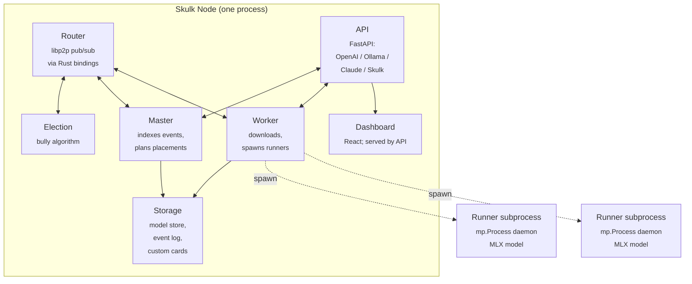
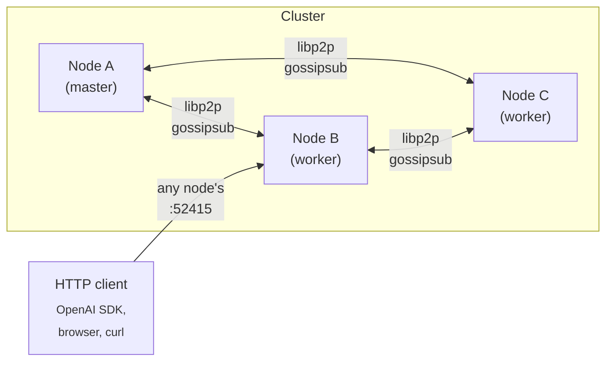
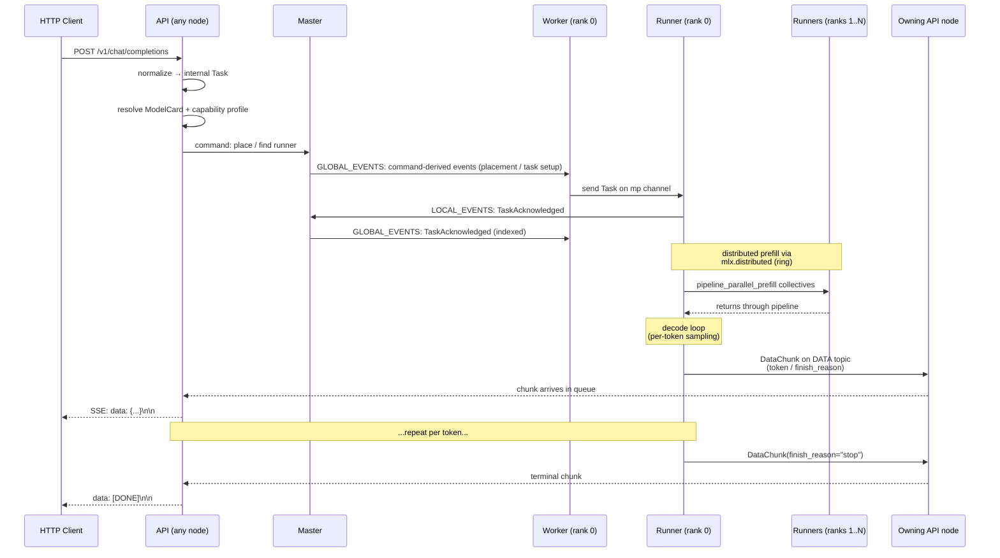

<!-- Copyright 2025 Foxlight Foundation -->

This is the long-form mental model for how Skulk is put together end to end. Read it once if you're picking the codebase up cold; come back to specific sections when you need to debug or extend a particular subsystem. For dense per-symbol lookups, see [Architecture Reference](architecture-reference).

## What Skulk is

Skulk is an interconnect fabric for multi-node AI compute: it connects multiple Apple Silicon (and increasingly Linux/CUDA) nodes into one cluster and moves work across them. Its headline use is distributed inference, where models are sharded across nodes, any node's API can serve cluster-wide requests, and the cluster keeps running through node arrivals, departures, and master failures. One Python binary (`uv run skulk`) is everything you need on each node: the same process is router, worker, master-eligible coordinator, election participant, API server, and, when its built assets are present, dashboard host. A headless node (for example a Linux worker with no built dashboard) runs as a full node and serves the API without the UI.

The design choices that shape almost everything else:

- **Event-sourced decisions.** Correctness-critical cluster facts (instances, runners, terminal download outcomes, tracing toggles) flow through an ordered event log. Observational latest-value readings stay outside it. State is the result of `apply()`-ing events to a Pydantic model that is treated as immutable by convention (replaced wholesale by `apply()` rather than mutated in place).
- **One master at a time.** A bully election picks the master; only the master indexes events. Failover is automatic, and the promoted node seeds the new session from its replicated state, so placed instances and bounded steward-action recovery truth survive a master restart: workers rebuild their runners and serving resumes after a model-reload-sized gap, while the new master resumes actionable approved or dispatched proposals. Instances with a rank on the dead master are cleaned up once live topology confirms the node is gone.
- **libp2p pub/sub for transport.** Topics carry commands, events, telemetry, and connection updates between nodes. Election and telemetry each use dedicated Python egress plus their own gossipsub behavior, protocol, and per-peer handler queues on the same libp2p swarm, so telemetry pressure cannot consume control or election capacity. Election alone retains its temporary legacy-protocol compatibility copy.
- **MLX as the inference backend.** Pipeline-parallel and tensor-parallel sharding strategies sit on top of `mlx.distributed`'s ring or jaccl/RDMA backends.
- **Subprocess isolation for runners.** Each model instance runs in its own `mp.Process` with its own MLX/Metal context, so a crash or hang in one runner can't bring down the rest of the node. The shipped systemd unit sets `OOMPolicy=continue` for the same boundary: if Linux OOM-kills a runner child, systemd leaves the Skulk parent, API, and co-hosted model store alive while the supervisor and crash breaker handle the failed runner.

## The shape of a node

A single Skulk process hosts seven cooperating subsystems sharing one event loop and one set of typed channels:



Each subsystem has its own concern:

- **Router** wraps libp2p (via PyO3 Rust bindings) and exposes typed pub/sub topics: `GLOBAL_EVENTS`, `LOCAL_EVENTS`, `COMMANDS`, `DOWNLOAD_COMMANDS`, `STATE_SYNC_MESSAGES`, `ELECTION_MESSAGES`, `AUTHORITY_MESSAGES`, `CONNECTION_MESSAGES`, `TELEMETRY`, `DATA`, `PROVIDER_DATA`, `REALTIME_AUDIO`, `SPEECH_MEDIA`, `TRACE_DATA`, and `VISION_MEDIA`. Components subscribe by topic; every topic has a machine-checked control, authority, telemetry, or data plane assignment and payloads are validated Pydantic types.
- **Telemetry plane** (`TELEMETRY` topic) carries last-write-wins readings that are *not* decisions: each node's `participation` role and `backends`, memory and system profile, observational identity/disk/rdma-ctl status, heartbeat, non-terminal model-download progress, and compact node-local artifact availability. A node-owned inventory service runs independently of the HTTP API (including under `--no-api`), publishes at startup and after storage/runtime transitions, and repairs every 60 seconds; a fixed entry ceiling and truncation flag keep it bounded. Detached records for read-only model roots receive one full hash verification per stable file-stat fingerprint, so periodic repair scans reuse process-local trust while any path, device, inode, size, modification-time, or change-time transition forces re-verification. Canonical card bodies, manifests, and the store catalog never ride telemetry: the store host advertises only its role, and API nodes synthesize canonical `store_local` locations while projecting additional `node_cache` copies from `TelemetryView`. Local receipt time establishes freshness; readings become partial after two publication intervals and are pruned with node membership. Local producers never wait for network capacity: a fixed 256-key admission map replaces older values for the same node/reading (download progress additionally keys by model), evicts the oldest distinct key only at the bound, and drains through a one-packet network queue. Telemetry then uses a dedicated gossipsub behavior and protocol with independent per-peer handler queues: transport isolation is structural, so a saturated control or election path cannot delay telemetry and telemetry fan-out cannot consume control or election capacity. Aggregate pressure is available at `GET /v1/diagnostics/telemetry`. Readings land in an in-memory `TelemetryView`, not event-sourced `State`; only download completion and failure remain durable. Attempt identities stop delayed progress on the independent protocol from overriding terminal/reset decisions, while `GET /state` overlays the live view to preserve the dashboard's wire shape. `GET /store/registry` exposes inventory coverage as `syncing`, `current`, `degraded`, or `unavailable`; this is operator/read truth only. Store reconciliation continues to query each node's `/store/storage` directly and verify identities and manifests before transferring bytes. The system profile includes a collector-agnostic accelerator block (GPU utilization, VRAM used and total, power, temperature, clock) normalized at each platform collector. Because the context-admission ceiling must be identical across ranks but telemetry is unordered, the master computes it once at placement time and stamps it onto the instance (`context_token_limit`). **Connectivity readings stay on the control plane**: `node_network`, the thunderbolt maps, and derived `thunderbolt_bridge_cycles` define the topology graph and therefore require ordered event-sourced state.
  Canonical locality does not depend on card resolution:
  `cache_inventory.store_nodes` identifies the live store hosts even when a
  legacy entry has not yet established exact installed-generation provenance.
- **Data plane** has six typed families. `DATA` carries generated token, image, embedding, transcription, and audio output; `PROVIDER_DATA` carries extension-provider stream frames without adding arbitrary provider payloads to `DataChunk`; `REALTIME_AUDIO` carries built-in realtime STT PCM from an owning API to the selected speech worker; `SPEECH_MEDIA` carries bounded request-scoped TTS reference audio and batch STT uploads; `TRACE_DATA` carries terminal per-rank diagnostic traces to the owning API; and `VISION_MEDIA` carries VLM and image-edit input from the owning API directly to every MLX worker rank selected by the master's authoritative `TaskCreated` decision, or only to the driver of a llama.cpp RPC instance. Streaming families use explicit per-stream lifecycles and every family uses node-addressed same-node short circuit/remote delivery on Zenoh. Vision uses `opened -> chunk* -> completed -> accepted`, with a source-side deadline requiring acceptance from every selected target. Batch STT waits for `TaskCreated`, then sends raw frames to the selected worker and gates runner dispatch on exact sequence, task owner, count, and SHA-256 verification. Trace assembly is best-effort and bounded by task count and age. Vision ingress has its own bounded network-receive lanes and remote dispatcher, stream/owner admission limits, five-minute lease, and `NodeDiagnostics.visionMediaEgress` counters so a large upload cannot delay control receive or consume generated-output capacity. Workers retain incomplete input only within fixed frame, per-command byte, process byte, stream-count, and age bounds; they expose it to planning only after the completion frame, sequence set, metadata, authoritative task owner, and SHA-256 digest verify and the acknowledgement is admitted to transport. `NodeDiagnostics.visionMediaIngress` reports API-staged commands/bytes, pending worker acknowledgements, retained worker streams/frames/bytes, verified streams, completions, rejections, and expirations. A generated-output command queue has a separate 30-minute no-frame resource lease, renewed by every producer frame observed by egress. The master never indexes, persists, or application-relays payloads from these families. OpenAI response models retain their required base64/JSON shapes, while provider, realtime audio, speech media, and vision media cluster framing uses bounded headers plus raw bytes. See [how the cluster communicates](cluster-communication) for transport and trust details.

  Vision admission is hard-bounded: an API accepts at most 64 staged plus active commands, 32 MiB per command, and 512 MiB across staged plus active transfers. The isolated remote dispatcher admits 16 streams total and per destination owner, with a 66-frame queue holding one open frame, at most 64 half-megabyte payload frames, and one completion frame per stream (512 MiB maximum queued media), 64 bounded rejection tasks, and a five-minute idle lease. Network receive has a separate 66-frame payload lane and 1024-frame metadata-only terminal lane. A worker admits 64 streams, 64 media chunks and 32 MiB per command, 512 MiB process-wide, and retains at most 64 pre-task failure reports; both worker retention and source acknowledgement expire after five minutes. Same-process delivery uses rendezvous channels rather than hidden packet queues.
- **Election** runs the bully algorithm and broadcasts `ELECTION_MESSAGES`. The winner takes the master role. The topic has its own bounded Python egress queue and is negotiated on a dedicated gossipsub protocol with its own per-peer handler queue, so saturation from control or telemetry fan-out cannot consume election capacity. A compatibility copy on the legacy protocol lets old and new nodes elect during staggered upgrades; identical candidates received on both paths count once. If a better same-round proposal arrives after the local campaign timeout, the node corrects its completed result using the original vote ordering. Delayed subscription exchange therefore does not require another connection change to repair conflicting masters.
- **Operator authority consensus** is a separate crash-fault protocol over signed, stable-installation-addressed `AUTHORITY_MESSAGES`. Ballot promises, accepted values, votes, certificates, and bounded catch-up suffixes contain public consensus metadata only; credentials, prompts, relay keys, and decrypted authority records never enter the topic. The topic has its own bounded Python egress queue so ordinary Python control backlog cannot queue ahead of a ballot or certificate, while the current Rust transport carries it on the default authenticated libp2p gossipsub behavior. The consensus service lifecycle is not started yet, so registering the topic alone grants no operator capability.
- **Master** admits only an explicit allowlist of durable control decisions and ordered connectivity facts, indexes those events into the event log (writing them to disk via `DiskEventLog`), publishes indexed events on `GLOBAL_EVENTS` for followers, and decides instance placements when a model is launched. Decodable payload events, observational telemetry, and transient download progress are skipped at their source sequence before ordering, persistence, replay, state application, or global broadcast. Snapshot-tail replay runs on one coalescing background worker and emits 32-event bursts at a bounded cadence, so a joining node cannot make a retained 10k-event tail monopolize command processing or overflow slower peers. The master also warns when the log grows above 60 events/min for a full minute while no task or download is active, identifying periodic control-plane amplification before it becomes replay pressure.
- **Worker** receives indexed events, applies them to its local view of `State`, downloads model weights to disk when assigned a placement, and spawns / supervises runner subprocesses. Before spawning, it refuses a shard that won't fit local memory (a last-resort guard below the master's admission check, using the same shared estimator), and a crash circuit breaker gives up on a runner that keeps failing rather than relaunching it into another GPU-memory leak. When the give-up is driven by that *memory* guard (not a crash) the worker asks the master to re-place the model one node wider via `RefuseInstancePlacement` instead of letting the placement silently disappear (see "Placement memory admission" below).
- **Runner** is *not* in the same process; it's a `mp.Process` daemon spawned by the worker. It owns one model and serves inference tasks for it. Multiple runners (one per pipeline rank) coordinate via `mlx.distributed` collectives.
- **API** is a FastAPI app that exposes inference endpoints in four wire formats (OpenAI Chat Completions, OpenAI Responses, Anthropic Messages, Ollama) and Skulk-native control endpoints (placements, diagnostics, traces, config). It also serves the dashboard build at `/` when those assets are present; a headless node built without the UI skips that mount and serves the API alone.
- **Storage** is a collection of on-disk responsibilities: the event log (msgpack + zstd), the model cache directory, custom model cards (per-user TOML files), and the optional shared model store.

Because those four wire formats are the ones external tools already speak,
connecting a coding agent or a chat application to a cluster is a configuration
change rather than an integration. The dashboard's Integrations page writes that
configuration for the operator, and it writes it from live cluster state rather
than from a template: the models it names are the ones that currently have a
ready instance, the context windows are those models' real windows, and the
per-model flags follow the same resolved capability profile the runtime uses, so
a vision model is declared as accepting images and a model that marks its
reasoning is set up to send that reasoning back on later turns. The address it
embeds is the node's routable address, not `localhost`, because the tool being
configured usually runs on a different machine.

Signed registry-v2 model cards can describe one exact `artifact_bundle`: a
content-derived required-file manifest plus an optional repository-relative
loader root. The direct and central-store paths fetch only those files, verify
their immutable sizes/object identities, preserve layout, and include bundle
identity in installed-generation matching. This allows multiple independent
quants in one repository/revision without store collisions. Legacy cards remain
on their established repository-wide tensor or pinned-GGUF path.

## The shape of a cluster



Clusters form via libp2p mDNS or via explicit `--bootstrap-peers` multiaddrs. New nodes broadcast their identity, observe the current master, and snapshot-bootstrap from the master's published `State` snapshot before applying the retained event tail. Replay requests are coalesced and served asynchronously in paced 32-event bursts (a 250 ms interval between bursts), preserving live command/event scheduling and bounding the burst presented to slower followers. Once bootstrapped, nodes become first-class members. Discovery initially tries every advertised address so a direct Thunderbolt path can be established, but a link-local address that failed while the peer connected elsewhere is retried only once per minute instead of every five seconds. Connection health uses a five-second ping budget and requires three consecutive failures on the same socket before closing it. API reachability discovery continues probing advertised addresses independently so a working direct path can still become a placement and ring-transport candidate.

Any node's API can serve any request: the API forwards work to the placed runners through the master/worker plumbing. Operators usually pick one node as the public entry point (commonly the most stable / best-connected one) but the cluster doesn't require a specific entry point.

### Deployment & versioning

**All nodes in a cluster must run the same Skulk version and source build. Mixed-build clusters are unsupported for workloads: this is a degraded deployment window, not an interoperability mode.** Skulk's correctness-bearing wire types remain strict (`extra="forbid"`), so an older node can reject events, commands, or snapshots that carry a newer node's fields; serving or mutating cluster state while builds differ can produce state divergence, dropped placements, and election churn. Complete deployment across the fleet before starting new inference work. There is no cross-version snapshot-hydration concession: a node never reloads its own State across restart (node identity is ephemeral and State is rebuilt from the event log / state-sync, not persisted-and-rehydrated), so a snapshot carrying a previous version's removed fields is rejected by `extra="forbid"`. (An earlier before-validator that stripped removed keys was removed: it forced the whole model into strict Python-mode validation, where ISO datetime strings such as `lastSeen` were rejected, silently breaking state-sync.) Cross-version *interoperation* remains deliberately out of scope.

Operational diagnostics are the narrow exception required to observe and finish a staggered deployment safely. Peer diagnostic responses ignore unknown additive fields recursively, additive counters use compatibility defaults, and the collector compares each peer's reported package version and source commit. `GET /v1/diagnostics/cluster` returns aggregate and per-node `versionStatus`; `GET /state` adds a warning-level `version_mismatch` health reason while known live builds disagree. This tolerance does not extend to events, commands, state snapshots, model traffic, or inference compatibility.

The wire itself enforces build compatibility one level deeper. The
networking layer derives its private-network key from a wire version
constant (`NETWORK_VERSION`), so two builds whose network protocols differ
refuse to connect at all (loudly) rather than half-working. Any change to
wire behavior in the networking crate bumps that constant in the same
commit (CI enforces the pairing against a wire-compatibility log), because
the half-working alternative is the worst failure this system knows: a
node that connects, syncs the event log, participates in election, and yet
never appears in membership because one protocol silently reaches nobody.
The service startup script complements this by rebuilding the Rust
bindings whenever a pulled commit touches the Rust tree, so a fleet cannot
silently run stale wire code while its source tree reports current.

One more note on the graph the dashboard draws and placement searches: it
is built from two sources. Workers probe each other's advertised addresses
and record the paths that verify, and every node also records its live,
authenticated fabric connections as edges in their own right. The second
source is what keeps a member behind NAT or a proxy visible and placeable:
such a node's advertised addresses may all be unreachable from its peers
while the connection that carries its traffic works perfectly, and before
the session edge existed it rendered as a floating, edgeless node in
exactly that healthy state. Addresses that repeatedly fail their probes
are retried on a slower cadence rather than every sweep, so a remote
membership does not flood logs probing paths that can never work. An edge
can also be the first the cluster hears of a peer, minting its graph node
before the peer has published any node information; if that peer
disconnects without ever becoming a member, deleting its last edge also
removes the node, so a crash-looping box cannot litter the graph with
phantom entries that the membership timeout, which only tracks nodes it
has heard from, could never reap.

## Lifecycle of a request

This is the path a chat completion takes from HTTP through to SSE response:



The eleven steps in detail:

1. **HTTP arrival.** Request hits FastAPI on any node's port (default 52415). The adapter for the wire format (OpenAI / Ollama / Claude / Responses) lives in `src/skulk/api/adapters/`.
2. **Normalization.** The adapter transforms the wire-format payload into an internal `Task` (`src/skulk/shared/types/tasks.py`).
3. **Capability resolution.** The API resolves the request against the bound `ModelCard` and computes a `ResolvedCapabilityProfile` (`src/skulk/shared/models/capabilities.py`). This decides prompt rendering, output parsing, tool-call format, reasoning format, vision handling, speech metadata, and a few MLX runtime knobs. Output parsing for channel-delimited reasoning formats (notably gpt-oss "harmony") is applied in the runner per engine: the MLX runner parses harmony at the token level (`parse_gpt_oss`), and the llama.cpp runner reparses it from llama.cpp's detokenized text (`HarmonyTextParser`), both splitting the `analysis` channel into reasoning and the `final` channel into content so control markers never reach the client.
4. **Runner discovery.** The API resolves the request against running instances via `_resolve_and_validate_text_model`. If no instance is currently placed for the model, the API returns HTTP 404: placement is **not** automatic on chat requests; operators must call `/instance` or `/place_instance` first to spin up the model. Once an instance exists, the API issues a command on the `COMMANDS` topic that the master indexes.
5. **Worker dispatch and runner acknowledgement.** Each rank's worker forwards the `Task` over an `mp.Queue` to its runner subprocess. The runner emits `TaskAcknowledged` on its outgoing event channel (see `src/skulk/worker/runner/llm_inference/runner.py:236`); the worker forwards that to `LOCAL_EVENTS`, the master indexes it, and it is republished on `GLOBAL_EVENTS` so every node observes the same acknowledged-state transition.
6. **Prompt rendering.** The runner renders the chat history into tokens. Family-specific renderers (e.g., Gemma 4's `<|turn>` template, DeepSeek's DSML) handle the format. For a single-node MLX vision placement, Skulk loads the model and processor through that model family's native `mlx-vlm` implementation; this preserves family-specific image grids and multimodal positional encoding without routing supported native processors through PyTorch or `torchvision`. The macOS runtime nevertheless installs a pinned `torchvision` because Transformers 5 gates its `AutoImageProcessor` fallback behind that package, and supported families still exercise that fallback. Converted Qwen3.5/3.6 MLX bundles are protected from the `mlx-vlm` 0.6.4 norm sanitizer while the project remains on MLX 0.31.2. Vision requests fail explicitly when processor loading or image preprocessing fails—the runner must never silently continue as text-only and invite a hallucinated description. MLX vision-capable instances use a request-aware dual-mode scheduler: consecutive text-only requests enter the normal batch generator, while an image-bearing request enters the native reference generator alone. The engines never overlap, FIFO modality boundaries prevent starvation, and terminal generation statistics report the actual path and admission width per request.
7. **Distributed prefill.** Pipeline-parallel models split the layer stack across ranks. Each rank computes its slice's prefill, sends activations to the next rank via `mx.distributed.send`, and barriers synchronize phase transitions. Tensor-parallel models do per-layer collectives within a rank.
8. **Decode loop.** Per token, the runner runs forward through its layer slice, exchanges activations with peers, samples (or accepts an injected token from speculative decoding), and emits the resulting chunk. Speculative decoding runs on single-node, tensor-parallel, and pipeline placements via one loop; on multi-node *pipeline* placements exactly one rank, the decider (the last rank), drafts and makes every accept/reject decision, broadcasting draft tokens and the per-round accept outcome through fixed-shape collectives so the committed stream is identical on every rank by construction rather than by numerical luck (heterogeneous chips produce divergent per-rank logits, and relying on every rank recomputing the same decision is exactly what desynchronizes and crashes mixed-chip clusters). Multi-node *tensor* placements instead load the drafter on every rank and draft rank-symmetrically: a lone TP decider cannot draft "locally" because draft logits go through the TP-sharded lm_head, an all-rank collective that idle receivers would never join; rank-symmetric drafting relies on bit-identical per-rank logits, which TP placements already require in practice. Assistant-style drafters that cross-attend the target's KV occupy the same decider seat, since the last pipeline rank is the only rank holding the KV layers they attend; such drafters declare `reads_target_cache` so the loop keeps the target cache fully committed before every draft. It is mechanism-agnostic: the loop owns verification, accept/reject, and cache reconciliation, and talks to a `Drafter` protocol (`src/skulk/worker/engines/mlx/drafters/`) behind which family-specific draft mechanisms live: Qwen3.5 sidecar MTP heads (fc projection plus the sidecar's transformer block with a private KV cache, quantized on load to match the target), DeepSeek projection-only heads, and the Gemma 4 assistant model (a chain-trained companion that cross-attends the target's KV cache). Family facts (sidecar norm conventions, fc concat orders, hidden-state convention) are declarative data resolved from layout-keyed defaults plus model-card overrides, never constants in drafter code. The loop guarantees drafters a gapless, exactly-once stream of committed `(hidden, next-token)` pairs so stateful drafters keep positional history aligned with the target sequence. Rounds are *bonus-driven*: the loop carries an emitted-but-unforwarded bonus token, drafts up to the card's `mtp_max_depth` candidates from the bonus position, verifies `[bonus, drafts]` in a single K+1-token forward (the round's only target forward), commits the longest matching prefix, and samples the next bonus from the first non-matching row (the correction on a partial reject, the free next token on a full accept); the next round drafts from that position, so post-correction drafts, statistically the easiest, are never skipped. Cache reconciliation on a reject prefers the model's native `rollback_speculative_cache` (gemma4), else restores an SSM snapshot and *defers* the committed prefix to ride at the front of the next verify forward (extra verify width is effectively free on memory-bound decode), else plainly trims pure-KV caches. Depth is a per-model tuning knob set by measurement on the carded artifact. At temperature > 0, acceptance switches to Leviathan-Chen probability-ratio rejection sampling over the effective sampler distributions (with residual resampling on reject), preserving the output distribution exactly while keeping the speedup; depth is forced to 1 under sampling.
9. **Output streaming.** One model-family output runner publishes `started`, ordered payload frames, and one terminal frame on `DATA`: rank 0 for text, embedding, and speech families, or the primary terminal pipeline stage for image generation. The owning API validates that lifecycle before draining payloads into the request queue. On Zenoh each remote command has an independent bounded egress worker with a renewed-on-frame 30-minute idle lease, while same-node output short-circuits network egress. An omitted terminal therefore ends in typed failure and queue reclamation instead of retaining admission forever. The master does not index or relay output (see the Data plane note above).
10. **SSE serialization.** The API's adapter for the wire format converts each chunk to its on-the-wire shape (`data: {...}\n\n`) and yields it on the SSE stream.
11. **Termination.** A chunk with `finish_reason != None` sends `data: [DONE]\n\n` and closes the stream. (Stream termination is hardened against cancel races and silent worker failures.)

For non-streaming responses the same flow happens but the API accumulates chunks before responding once. For embeddings and image generation the runner type and Task type differ but the master/worker/runner shape stays the same.

## State and events

Skulk is event-sourced because distributed clusters need a clear notion of "what has the cluster agreed has happened." The mechanics:

- **State** (`src/skulk/shared/types/state.py`) is a Pydantic model treated as immutable by convention: `apply()` returns a new `State` rather than mutating in place, even though the model is not declared `frozen=True`. It carries everything every node needs: topology, instances, runners, downloads, tracing flags, network stats, and so on.
- **`apply()`** (`src/skulk/shared/apply.py`) is a pure function: `(State, IndexedEvent) -> State`. Given the same events in the same order, every node lands on byte-identical state.
- **The master indexes events.** Every event arrives at the master via `LOCAL_EVENTS`, gets a monotonically increasing index, gets persisted to the disk event log, and gets republished on `GLOBAL_EVENTS`.
- **Followers replay.** A new node bootstraps by requesting the current state snapshot, applying it, then replaying retained events at indices after the snapshot's high-water mark.

Download lifecycle is split by semantics. `DownloadPending` is a rare ordered start/reset decision that clears an older durable outcome; `DownloadCompleted` and `DownloadFailed` are terminal `NodeDownloadProgress` events retained in `State`. `DownloadOngoing` remains decodable for replay compatibility but new producers publish it only as telemetry. Repository callbacks are serialized through one bounded per-download coalescer, use the canonical registered byte total, and pass a monotonic fraction gate before latest-value telemetry admission. Every attempt has an opaque identity shared by transient and terminal status. This preserves terminal ordering even when the dedicated telemetry protocol delivers an older sample after its control event, prevents progress traffic from growing replay state, and keeps placement, workers, `/state`, and node health reading one effective overlay.

Why event sourcing here:

- **Observable history.** Every state change is replayable. Debugging a "how did we get into this state?" question reduces to inspecting the event log.
- **Deterministic recovery.** A node restart replays from the last snapshot + tail. No partial state.
- **Cheap state distribution.** Followers don't need a separate state-replication channel; events are the channel.

Operationally, the rule of thumb:

- **Events are past tense** ("`TaskStatusUpdated`", "`InstanceCreated`", "`RunnerStatusUpdated`", "`TaskDeleted`"). Once published, they're immutable history.
- **Commands are imperative** ("`PlaceInstance`", "`DeleteInstance`", "`TaskFinished`", "`SetTracingEnabled`"). They request the system change state.

`PlaceInstance` carries an optional `excluded_nodes` list. The master's placement planner treats those nodes as absent when scoring candidate cycles for that single placement only: it's a per-launch hint, not a cluster-wide flag. Already-running instances on the listed nodes are unaffected. Operators set the list from the dashboard's placement modal before pressing Launch. The effective exclusions are also stamped onto the placed instance itself, so automatic repair re-placements (a memory-refused shard, a failed download) keep honoring the operator's exclusions rather than searching the full topology; before the stamp existed, a repaired instance could land on exactly the nodes the caller excluded.

The placement minted from `PlaceInstance` uses the command ID as its instance
ID. `POST /place_instance` returns both names for that value, giving clients an
exact acknowledgement-to-runtime correlation even when several operators
place the same model concurrently. A repair placement receives a fresh command
and therefore a fresh identity.

Discrete-GPU admission also accounts for committed concrete shards before their
allocations appear in telemetry. The usable pool is the smaller of observed free
VRAM and the physical working-set ceiling minus existing weights, overhead, and
stamped context-window estimates. Loaded allocations are not subtracted twice.
The master reserves locally created instances before queuing their events, then
hands those reservations to indexed state. Deletion removes the commitment only
when indexed; stale observed usage can still constrain the next load. API
previews, ordinary placement, repair, and steward placement share this accounting.
Exact GPU placements must also fit the remaining pool; omitted non-RPC backends
are resolved and stamped from advertised compatible engines before admission.
Legacy unstamped GPU-host shards reserve capacity conservatively.
An asynchronous exact or quick-launch refusal retains `placement_failed` history
for the acknowledged instance identity, including when API preflight succeeded. UMA pools retain
their existing host-memory rules. RPC instances retain observed-memory accounting
because llama.cpp selects their per-device partitions at runtime.

The planner's memory admission is per node, not summed across the candidate cycle: Tensor sharding splits the weights evenly across ranks while Pipeline allocates layers proportionally to each node's available memory, and every node must fit its weight share times a runtime-overhead factor (KV cache, activations, MLX buffers, the runner process) plus a flat floor, and an exact weights-equal-free-memory fit is rejected because it thrashes rather than runs. "Available memory" here is the GPU-wireable figure, `total − wired − anonymous − compressor` from a `vm_stat` snapshot taken alongside each telemetry sample, not the naive free-plus-inactive figure, which counts reclaimable file cache as used (after downloading a model, the weights sitting in file cache would deflate availability by the model's full size and refuse a placement that runs comfortably; macOS evicts that cache the moment Metal wires pages). It deliberately does not credit compression of idle anonymous memory. Because that availability rides the telemetry plane (last-write-wins gossip), it lags a teardown by a few rounds: right after an instance is deleted the freed memory is not yet reflected, so a placement issued immediately afterward (a test harness or a rapid model swap) would read deflated availability and be refused until the gossip settles. The recently-freed credit mechanism is disabled by default because deletion can precede actual memory release; admission waits for observed availability, with the worker's pre-load fit guard as the final check. Placement failures are typed: a topology gap, an exclusion that removed every candidate, a per-node memory shortfall (with the arithmetic), and the not-an-error startup cases where cluster info simply has not finished gossiping (`PlacementInfoPendingError`, which covers both phases: connection edges lagging node identities, and memory info lagging the edges) are all distinct, and `POST /place_instance` dry-runs the placement against replicated state so callers get the real reason as a 400/503 instead of an acknowledged command that silently fails on the master.

The master admits on the gossiped (telemetry-plane, last-write-wins) `ram_available`, while the worker's pre-spawn guard reads a fresh live `vm_stat` figure at load time. On a borderline multi-node split the live reading can sit just below the admitted estimate, so the master admits a cycle the worker then refuses. The worker guard therefore allows a small fit tolerance (10% of usable): a shard's footprint already bakes in the engine overhead factor, a full KV reservation, and a flat floor, so a sub-GB miss is within that pad and within live-versus-gossip jitter, and refusing on it would flip a placement the master admitted into a needless failure (a 0.2GB / 2% miss was observed refusing a 24B model at the load re-check across a 3-node ring). Only a shortfall beyond the tolerance, the signature of a node that genuinely lost memory since admission, trips the guard. When it does, rather than letting that instance vanish, the worker emits `RefuseInstancePlacement` and the master re-places the same model one node wider (`min_nodes` = refused width + 1) so each node holds a smaller share. On a heterogeneous cluster "wider" is not always possible even when a working placement exists: engines differ per node, so a GGUF model refused by one GPU node may fit alone on another GPU node while a Mac can never join its cycle. When no wider cycle exists, the master therefore falls back once to a single-node placement that excludes the refusing node. A refusal against that fallback is terminal: the master tears the placement down, cancels the model downloads it started, and gives up, which bounds the refusal chain at two hops so it can never oscillate between two refusing nodes. This self-corrects tight splits instead of requiring an operator to notice and re-launch.

A separate failure mode is a rank whose model **download** fails terminally (disk full, a transient Hugging Face or network error). The ring still forms and every rank waits for all ranks to become load-ready, but the failed rank never will, so the instance would otherwise sit "loading" forever with nothing to recover it. The master's plan loop detects this from replicated state (a not-yet-ready instance whose any rank node carries a terminal download failure for the model), fails any in-flight request bound to it with the download error surfaced, tears the instance down, and re-places the model at the same width while excluding the failed node(s). If no healthy node set can host the width (for example the failure was cluster-wide), the re-placement raises `PlacementError` and the master stops at the teardown, which bounds recovery to the available nodes rather than looping. A transient or single-node failure therefore self-heals onto healthy nodes; a genuine shortfall fails cleanly with the reason instead of hanging. Recovery also clears the failed download record itself (resetting that node's download status to pending), because a stale terminal failure left in session state would otherwise condemn every future placement of the same model touching that node long after the cause, such as a freed disk, is gone.

This recovery is made visible so it is not mysterious. `GET /state` attaches a derived per-node health summary (a level of ok, warn, or error plus reasons, each with a message and a remediation), computed read-only from state already in the response: a terminal download failure on a node, a low or full models-volume disk (a pre-emptive warning before a download fails), and a node whose heartbeats are late enough to be at risk of pruning. The dashboard renders an amber or red badge on the affected topology node whose hover names the problem and how to fix it, so an operator sees why a node is being routed around rather than watching placements quietly avoid a normal-looking node.

Liveness itself is judged across both planes, and the distinction matters when reading state directly. Ordered events bump a node's `last_seen` in replicated state, but a healthy node may legitimately log nothing for long stretches: readings that rarely change (connectivity among them) are forwarded only when their payload differs from the last value the master confirmed into the log (the worker keeps re-sending an unconfirmed change each poll until it sees it echoed back, then goes quiet), precisely so the event log records history rather than heartbeats. (Periodic identical events are actively harmful here: they fill the bounded replay tail that joining nodes must consume, and replaying that accumulated burst can saturate a slower node's send queues and flap it out of the cluster.) The primary live signal is a payload-free `NodeHeartbeat` reading published on the telemetry plane every two seconds. Each peer stamps its local receipt time, so liveness never trusts a sender's wall clock. Ordinary non-heartbeat telemetry receipt remains an independent fallback, and the last indexed control event remains a final fallback for a node that has just joined. The master emits a one-shot warning when the dedicated heartbeat gap reaches ten seconds, logs recovery when it resumes, and prunes only when the freshest of all three signals exceeds the 30-second timeout. `NodeTimedOut` persists the deciding last-event, heartbeat, fallback-telemetry, effective, and timeout ages so the event log explains the prune after the ephemeral receipts are gone. A prune has one more cleanup obligation: because a killed node returns with a brand-new identity, lifecycle tasks (a mid-flight `Shutdown`, for example) belonging to an already-deleted instance can never be completed by anyone; the master reaps such tasks with a terminal failure after a short grace, so cluster task state converges instead of accumulating zombies. The API health summary uses the same three-signal freshness model. The consequence worth remembering: `last_seen` means "last logged event", not "last observed alive"; freshness lives primarily on the telemetry plane.

Task failure is part of the same event flow. The master's plan loop (the
same reconciliation pass that deletes instances on dead nodes) emits
`TaskFailed` for any in-flight API task (text generation, image generation,
image edits, embeddings) whose instance is gone or being torn down, computed before
`InstanceDeleted`/`NodeTimedOut` so the failure indexes ahead of the applies
that remove the task from state. The API reacts by delivering a terminal
error chunk into that command's stream: streaming responses close with an
error event, non-streaming requests fail instead of hanging. Two failure
shapes bypass this flow and are handled at their own boundaries: operator
instance deletion cancels in-flight tasks via `TaskStatusUpdated(Cancelled)`
(the API terminates those streams too), and a master failover starts a new
session that cannot carry the old session's tasks at all, so the API's
session reset fails every still-open command stream directly before
discarding its queue maps. Together these guarantee an open request is
terminated within seconds of any node death rather than dangling until the
client's own timeout.

Instance failure is retained separately from the request that happened to
expose it. A worker that gives up after repeated runner crashes, a wedge, an
unresponsive spawn, or an immutable model-identity rejection sends `FailInstance` instead of
an ordinary delete. The master emits `InstanceFailureRecorded` while the
placement still exists and only then emits `InstanceDeleted`. Node-loss and
terminal placement-recovery paths do the same. `State.instance_failures` keeps
the newest 64 records, replacing duplicate reports for one instance, so
`GET /state` API consumers and Skulk's own fabric cognition can explain why a
model vanished after its live instance and short-lived task records are gone.
Clean operator stops use `DeleteInstance` and intentionally
do not create failure history. The record contains stable categories, bounded
operator-safe runner detail, model and instance identities, assigned nodes, and
the master's UTC acceptance time; it never contains prompts or generated
content. Assigned-node history is limited to 64 entries; every retained
instance, model, and node identifier is limited to 256 UTF-8 bytes, with larger
values represented only by stable SHA-256 references. Replay rejects non-string
node identities rather than rewriting corrupted state. These constraints keep
repeated failures and replicated snapshots strictly bounded.

A snapshot-bootstrap rollout has one operational rule: once a master starts compacting old replay history after writing snapshots, older nodes that only know how to "replay from event 0" should be considered temporary guests during the rollout window. Upgrade all nodes before relying on bounded retention as the steady state.

### Heterogeneous nodes and capability-aware placement

GGUF memory admission separates artifact geometry from node serving settings.
The selected header supplies attention and recurrent dimensions through
`GgufCacheGeometry`; generated cards use those artifact dimensions even when a
repository config describes a different base-layer count. For the supported
Qwen3.5 scalar layout, admission charges FP32 recurrent state across configured
slots and rollback rows, plus the target and embedded-MTP attention caches.
`NodeResources.llama_server_settings` advertises the existing environment
controls, and placement stamps them into shard metadata. The runner rejects a
changed stamp before launch. Geometry remains signed card content for registry
models; loading a card does not silently enrich or replace its accepted identity.

A cluster can mix node types: Apple Silicon nodes serving MLX models and
non-Mac (for example AMD/Linux) nodes serving GGUF models through llama.cpp.
Placement is capability-aware so each model runs only where it can.

Every node advertises the compute **backends** it can serve as
`<engine>-<compute>` tags. The tag folds two axes into one self-describing
string: the engine selects the worker runner class (`mlx` or `llama_cpp`), and
the compute names the accelerator (`metal`, `vulkan`, `rocm`, `cuda`, `cpu`). A
macOS node advertises `{mlx, mlx-metal}`; a Linux node with an importable
`llama_cpp` built for its GPU adds `{llama_cpp, llama_cpp-vulkan}`. Backend
tags are derived per node from observed hardware and configuration (see
"A node that just works" below) and
gossiped on the telemetry plane as part of `NodeResources`.

The same reading carries exact `engineBuilds` and open `hardwareClasses`.
Python engines identify their installed distribution version; the configured
vLLM CLI reports the version of its separate managed environment, and native
served binaries use a SHA-256 content identity. Operators can supply a
canonical upstream identity with `SKULK_ENGINE_BUILDS`, a JSON object keyed by
engine or backend tag. These values are evidence inputs, not capability
declarations: they can satisfy an exact signed support claim only for a backend
the node already advertises.

`NodeResources` also carries the DATA transport that startup actually resolved
(`gossipsub` or `zenoh`). This is a fleet invariant, not a placement preference:
Skulk does not bridge the transports. `GET /state` merges the live resource map
back under `nodeResources` and derives an error-level
`data_transport_mismatch` health reason when live nodes disagree. The topology
health badge and per-node diagnostics therefore fail loudly instead of leaving a
cross-transport output timeout unexplained. A missing first resource reading is
treated as unknown during startup; a mismatch requires positive advertisements
of both transports.

Uniform transport advertisement is not the same as a formed mesh, so
`NodeResources` also carries `zenohConnectedPeers`: the node's live Zenoh
peer-transport count, sampled from the session that owns the data plane at
each advertisement. A startup grace window advertises unknown (`null`) while
mesh formation is still in flight; after it, a count of exactly 0 on a node
whose fleet has other live Zenoh members raises the error-level
`zenoh_isolated` health reason, and the node itself logs a recurring warning
naming the fix. This closes the silent-failure shape where a member that
multicast scouting cannot reach (for example one joined over a routed or
overlay network) looks healthy on the control plane while every remote stream
through it dies with transport errors. The placement planner consumes the same
positive-evidence predicate: it removes every candidate cycle touching a known
isolated node and returns a specific placement error if none remain. Unknown
peer counts stay eligible during startup, so missing telemetry does not create a
false hard failure.

Zenoh is the shipping default, including for a zero-config installation. Startup
binds a specific private-LAN or CGNAT fabric IPv4, falling back to loopback on
offline or public-only hosts, and enables local multicast scouting when no
explicit peer list is configured. A public listener requires an explicit
`SKULK_ZENOH_LISTEN`. Routed and Tailscale deployments can set
`SKULK_ZENOH_CONNECT`, which keeps multicast off and uses those fixed
endpoints; `SKULK_ZENOH_LISTEN` overrides the selected listener.
`SKULK_ZENOH_DATA_PLANE=0` is the explicit legacy-gossipsub escape hatch. This
keeps a fresh install on the same data-plane implementation as the regular E2E
qualification fleet instead of silently testing and shipping different paths.

The llama.cpp runner loads GGUF models with Flash Attention on by default (the
modern llama.cpp default; it fixes the slow padded-V-cache and full-size
sliding-window-cache path that gemma-style interleaved attention otherwise hits).
Set `SKULK_LLAMA_CPP_FLASH_ATTN=0` to disable it on a node whose compiled build
lacks Flash Attention kernels.

Alongside the two in-process engines (MLX and llama.cpp) there is a third,
**served-backend** engine (`llama_server`). Instead of loading the model in the
worker process, it launches an external `llama-server` subprocess and proxies its
OpenAI HTTP API. This is what unlocks llama.cpp's **native multi-token-prediction
speculative decoding** for models that ship MTP heads (Qwen3.6, DeepSeek, GLM,
Kimi, Nemotron): that machinery lives in the llama-server application, not in the
library the in-process runner links, so the only way to use it is to run and proxy
the server. A node offers this engine when `SKULK_LLAMA_SERVER_BIN` points at a
`llama-server` binary (built recent enough to expose `--spec-type`), and a model
opts in through its card's `compatible_backends` (`llama_server-…`) plus the
`served_spec_type` / `served_spec_n_max` runtime fields (for example
`served_spec_type = "draft_mtp"`). Most MTP families ship the heads inside the base
GGUF, but some speculative modes need a separate small draft model: a card names it
with `served_spec_draft_repo` / `served_spec_draft_file` and the worker downloads it
as a companion and passes it to the server as `--model-draft` (this is how Gemma 4
runs MTP, via its assistant as the draft model; `draft_dflash` engages a separate
block-parallel DFlash speculator the same way, for the drafter families
upstream's dflash architecture implements). The engine coexists with the
in-process llama.cpp runner; the same managed-server-plus-proxy shape carries the
`vllm` engine described next. See the setup notes for a non-Mac node in
[AMD / Strix Halo nodes](amd-strix-halo-nodes) and the env vars
`SKULK_LLAMA_SERVER_BIN` / `SKULK_LLAMA_SERVER_BACKENDS`. A node-local
`SKULK_LLAMA_SERVER_FORCE_NO_SPEC=1` forces speculative decoding off even for a
card that asks for it, so the same GGUF can be served in plain decode as an
apples-to-apples MTP-off baseline (a benchmarking and diagnostics knob, not for
normal operation).

The served engine also owns GGUF vision when the card pins one exact
`vision.projector_file` and `vision.projector_size` at the base artifact's
immutable `source_revision`. The worker authenticates that file against the
installed manifest, launches `llama-server --mmproj`, and disables projector
GPU offload only for an explicitly CPU-resolved placement. Vision and native
MTP may be enabled together; that combination runs with one server slot until
concurrent multimodal serving is qualified. Text-only and non-MTP vision
instances retain the configured slot count.

A second served-backend engine, `vllm`, reuses that same shape with a `vllm serve`
process instead of `llama-server`. vLLM is the **GPU-serving fast path**: its
continuous batching and paged attention keep latency low and grow aggregate
throughput as concurrent requests pile up, exactly where the single-stream engines
fall over. A head-to-head on a rented A100 (same gpt-oss-120B weights on both
engines) made the trade-off concrete: under 64 simultaneous requests llama.cpp's
time-to-first-token blew out to about 31 seconds while vLLM stayed near half a
second, and vLLM's total throughput kept climbing where llama.cpp flattened; but
for a *single* request llama.cpp was faster, because that particular A100 has no
native FP4 hardware and vLLM had to emulate the model's 4-bit format (a gap that
closes on newer Blackwell GPUs). So vLLM does not replace the in-process engines,
it **coexists** with them, and the planner chooses per model by the node's hardware
and how much concurrent load it expects. A node offers vLLM when `SKULK_VLLM_BIN`
points at the `vllm` CLI (it advertises `vllm-cuda` / `vllm-rocm`, GPU-only), and a
card opts in through `compatible_backends`. Because the right engine now depends on
the GPU *generation* (FP4 support and all), each node also reports its GPU compute
capability in telemetry, so placement can eventually route a model to the metal
that serves it best. Unlike the in-process MLX batch loop, the vLLM runner creates
concurrency by keeping several proxied generations in flight at once (one streaming
HTTP request per worker thread, bounded by `SKULK_VLLM_MAX_CONCURRENT_REQUESTS`) so
the server actually *sees* concurrent requests and its continuous batching engages;
without that the batching benefit never appears. The runner reports itself
running while any generation is in flight and returns to ready only when the last
one drains. Context windows for vLLM placements are deliberately capped (32,768 tokens,
applied at the placement stamp): vLLM commits and optimizes its entire
declared window at engine start, so a 262k-context card would otherwise turn
a minutes-long bring-up into more than an hour. Applying the cap where the
window is stamped keeps request admission and the serving engine in
agreement; it retires when vLLM-aware admission arrives. Checkpoints that
ship native multi-token-prediction heads (Qwen3.6 among them) can declare
vLLM speculative decoding on their card, engaging the model's own prediction
heads with no separate draft model; measured on an A100, this roughly
doubles single-stream decode on the dense Qwen3.6. This slice is
single-node text generation with tool calling: when a card pins vLLM's
native tool-call parser (the explicit runtime field
`vllm_tool_call_parser`; there is no family fallback, because one model
family can span tool-call generations with different wire formats), the
runner launches the server with it and a tool-enabled request runs
unstreamed so the caller receives the assembled call, the same shape as
the llama.cpp engines; a card with no resolvable parser rejects tool
requests loudly instead of silently dropping them. Logprobs, vLLM's own
multi-GPU parallelism, and vLLM-aware memory admission are follow-ups.

The vLLM server's lifecycle is guarded against GPU-memory leaks in both
directions. On teardown, the runner signals the server's entire process
group (the server starts in its own session), because vLLM runs its actual
engine in a grandchild process: terminating only the direct child could
leave that engine core alive holding the full GPU allocation. And at worker
startup, before the node advertises any capacity, a one-shot sweep reaps
engine-core processes orphaned by an earlier abrupt shutdown (recognized by
their process title and the fact that their parent is gone); without it, a
crashed node could come back up with tens of gigabytes of GPU memory
invisibly held, refusing placements for space nothing appears to own. Each
reap is logged, so a node that recovered says why.

The `llama_server` engine is also how a GGUF model larger than any single GPU node gets
served: **multi-node memory pooling over llama.cpp's RPC backend**. When a model
fits no single node but fits the combined GPU memory of several `llama_server`
nodes, the planner places an asymmetric pair of roles instead of a ring: one
**driver** node runs `llama-server --rpc donor:port,...` and holds the model
file, and each **donor** node runs a small `ggml-rpc-server` that lends its GPU
memory. llama.cpp itself splits the weights and KV across the pooled devices in
proportion to their free memory, so Skulk assigns no layer ranges; the placement
just picks the driver (the largest usable capacity after any fixed projector
reservation, with model locality as a tie-break), chooses each donor's endpoint
address from the observed connectivity between the pair (preferring the fastest
interconnect, such as a USB4/Thunderbolt link between two Linux boxes), and
stamps both onto the instance. Pooling trades some decode speed for capacity
(the point is the model class that otherwise cannot run at all, not a speedup),
and prefill is unaffected. A single-node placement is always preferred whenever
the model fits one node, so this shape only appears for genuinely pooled-only
models. If a donor dies mid-generation the driver exits immediately and the
normal crash recovery tears the instance down and re-places it.

Vision RPC is deliberately narrower than text-only RPC: every rank must share
one exact `llama_server-cuda`, `llama_server-rocm`, or `llama_server-vulkan`
tag. The complete projector footprint is reserved on the driver before pooled
model/KV admission, and image bytes are delivered only to that driver because
donors never execute inference. Distributed MLX vision continues to deliver
the image to every selected rank.

A model card's legacy runtime projection declares two placement axes that are
deliberately separate from the memory/topology axes above:

- `compatible_backends` is a **hard filter**: the planner excludes any node whose
  advertised backends do not intersect it. A GGUF card lists the llama.cpp
  backends, so it can only land on a llama.cpp node; an MLX card lists MLX, so it
  stays on the Macs; a speech card lists `mlx_audio`, so it can only land on a
  node whose probed `mlx_audio` package can serve it. This is what keeps an MLX
  model off an AMD node, a GGUF model off a Mac without an MLX llama.cpp shim,
  and a TTS/STT model off a text-only MLX runner.
- `backend_preference` is a **soft score**: when several compatible nodes
  qualify, the planner prefers the node whose backend ranks earliest in the
  card's preference list (for example preferring a GPU backend over CPU). The
  list is fallback order, not a client selection: if an earlier backend or host
  is not currently admissible, placement continues with the next candidate.
- `max_pipeline_split_layer` is a **hard sharding constraint** for architectures
  whose tail layers reuse KV from earlier concrete layers. Proportional layer
  allocation may move boundaries left, but never beyond this limit; the usual
  per-node memory check then validates the adjusted shards before launch.

The signed registry adds an adaptive path without rewriting cards. Intrinsic
capability claims describe what the model or selected artifact can do. A
separate signed engine-support matrix records whether one exact engine build can
serve one architecture, artifact format, quantization, and capability, with
optional hardware constraints and auditable evidence. Placement unions active
`supported` matches with the card's legacy `compatible_backends`; experimental,
unsupported, stale-build, hardware-mismatched, other-artifact, and explicitly
incomplete claims add nothing. Empirical load and feature qualification is
bound to the immutable card tested; cited upstream engine compatibility may be
architecture-scoped. Existing cards therefore keep working while a new
architecture can become placeable as soon as independently signed support
evidence exists.

The engine axis (which runtime) remains orthogonal to the node axis (which
machine). The master resolves and stamps the concrete backend selected for each
node. The worker trusts that stamped choice and repeats the exact signed-matrix
check when it must use its node-local fallback. See the
[AMD Strix Halo nodes](./amd-strix-halo-nodes.md) guide for bringing up a
non-Mac node.

Model authorization is resolved before that admission pass without a second
approval ceremony. Publishing a revision-pinned signed registry card authorizes
the exact repository content selected by that card regardless of whether its
evidence provenance is Foxlight, agent, or community. Explicit model addition
is the corresponding operator decision for a custom card; when the caller omits
a revision, Skulk resolves `main` once and persists the immutable Hub commit.
The add response waits for its exact ordered mutation to appear in the local
catalog before acknowledging success. Historical executable custom cards with
no immutable revision are not grandfathered into this authorization model;
they fail closed until an operator re-adds them and thereby pins current truth.
Bundled cards are authorized by the Skulk release that ships them. The planner
therefore applies backend preference, locality, and capacity normally without a
trust-based node or model filter. Historical `model_trust` configuration and
approval endpoints remain inert compatibility surfaces for rolling upgrades.
Card lookup is deliberately non-mutating: read and launch paths may refresh the
signed registry but never synthesize or persist an unknown Hugging Face card.
Only the authenticated add endpoints cross that boundary. A caller-specified
exact placement must also reproduce the effective local catalog card byte for
byte across its shard assignments; matching an alias alone cannot substitute
caller-selected executable content. The elected master repeats that exact-card
comparison against its command-ordered card view immediately before accepting
either a quick or caller-specified exact placement, so a concurrent card
replacement or deletion wins before stale repository code can launch.
Bundled fallback cards that execute repository code require an immutable source
revision. Installed custom-card sidecars remain artifact-integrity records, but
only the durable custom-card definition keeps an unsigned model selectable; a
deleted custom card therefore cannot be recreated from retained model bytes.
Separately hosted processor, vision-weight, assistant, MTP, and speculative
draft repositories require their own immutable companion revisions for signed,
custom, and bundled cards alike.
The low-level explicit-download route is operator-authenticated and compares
its embedded shard card with the same authorized catalog before admitting bytes
to a node. Exact comparison ignores only the TUF snapshot publication stamp;
all executable, source, artifact, runtime, and capability truth still matches.
Custom-card creation accepts only a direct loopback request or an authenticated
operator-gateway request with write scope; successful gateway validation is
carried to the canonical route in the ASGI scope rather than through a
caller-spoofable header. Config convergence carries the Hugging Face token
across the PSK-encrypted fabric, so a token entered in any node's Settings
reaches the nodes that download; an absent-or-blank incoming token never
erases a recipient's local one, each write atomically replaces the owner-only
config file, and the HTTP config surface never returns the token. `POST /place_instance` re-evaluates current facts at launch.

For GGUF text models the bundled cards use that preference order deliberately:
they list both llama.cpp engines as compatible but rank the served
`llama_server` tags ahead of the in-process `llama_cpp` tags. The in-process
runner serves one request at a time, so under concurrent load its aggregate
throughput stays flat as clients are added; the served engine keeps several
generations in flight against `llama-server`'s parallel slots, and aggregate
tokens per second then scale with concurrency instead. Serial does not mean
unmanaged: the in-process runner admits requests through the same dispatch
loop the served engines use, at a width of one, so admitted work is bounded,
cancellation is race-safe, and every generation reports its serving node and
concurrency to the performance-envelope diagnostics rather than queueing
invisibly. On a node that
advertises a llama-server binary the model serves through the served proxy; on
a node without one, the preference is a soft order intersected with the node's
advertised backends, so the same card falls through to the in-process runner
unchanged. The per-node `SKULK_LLAMA_SERVER_PARALLEL` setting (default 16) names
how many generations that node serves at once, and the runner honors it exactly.

Above one slot the runner launches the server with a unified KV cache, which is
what makes that count honest. llama.cpp gives a slot the whole `-c` window when
the cache is unified and only an equal share of it (`n_ctx / N`) when it is not,
so without the unified cache asking for more slots would silently shrink every
request's real window below the limit placement stamped and the API admits
against. The unified cache costs no extra memory: the same total number of cells
is shared across slots rather than partitioned between them.

The slots still contend for one pool rather than private shares, so Skulk gates
generation by aggregate token reservations. It asks llama-server's
chat-completion token-count endpoint for the exact rendered prompt length,
adds the request's maximum output, and queues the request FIFO until that
reservation fits. FIFO ordering prevents a large reservation from starving
behind a sustained stream of later small ones. An omitted `max_tokens` receives
Skulk's normal 4096-token default; if token counting is unavailable, the request
reserves the whole pool and runs alone instead of risking an underestimate.
Thus the shipped 16-slot ceiling supports concurrent bounded traffic without
allowing a burst of long requests to exhaust and terminate the server.
`SKULK_LLAMA_SERVER_PARALLEL=1` remains an explicit serial-isolation option.

Context sizing for the GGUF engines is dynamic rather than a fixed constant.
Placement reserves KV cache for an 8192-token admission floor, but the window a
runner actually serves comes from a deterministic memory-fit ceiling the master
computes once at placement time and stamps onto the instance: for each hosting
node, the tokens whose KV cache fits that node's GPU working set after its
weight share and overhead, taken as the minimum across nodes and capped at the
card's advertised maximum context. Determinism is load-bearing here (every rank
must admit or reject a request identically or the collectives deadlock), so the
calculation uses only static inputs such as total RAM and a node's discrete
VRAM total, never the time-varying available-memory reading
(`instance_context_token_limit` in `src/skulk/shared/models/memory_estimate.py`).
The engines that commit their whole context window at load (in-process
llama.cpp, llama-server, vLLM) get the lifted window only where it lands in
discrete GPU VRAM, the same pool placement admitted the model against. A GGUF
placement on a node without discrete VRAM keeps the 8192-token floor. That
includes unified-memory AMD APUs: placement can use their combined BIOS
VRAM/GTT pool, but llama.cpp's load-time amdgpu allocation also consumes host
pages, so a steady-state combined-pool fit cannot safely justify a larger fixed
window. CPU fits similarly derive from total system RAM while the load-time
window competes with live available memory. An uncomputable fit (a card without
KV-head metadata, or a pooled RPC placement) also clamps back to the floor
rather than committing a fictitious window that would fail at load. MLX is
unaffected either way: it grows its KV cache lazily per request and keeps the
full memory/card fit. The practical effect is that a true discrete-VRAM GPU
node serves a model at the largest context that actually fits it, instead of a
fixed clamp that makes served models unusable for real-context work. The
[Architecture Reference](architecture-reference) carries the exact admission
arithmetic.

The compatibility decision has four independent layers: intrinsic model
capability, selected-artifact completeness, exact engine/build support, and
Skulk runner support. Signed capability claims preserve the first two even when
Skulk cannot use them yet. The support matrix supplies the third. Platform
limitations remain code-level gates applied last (for example, served vision
requires an exact projector pin, and only `mlx_audio` owns TTS/STT), so catalog
truth never shrinks to today's platform and no model card
needs editing when Skulk catches up.
Speech serving is the largest current example of that gating and has its own
section below.

Model families do not agree on how a tool call is written, so the in-process
engines read the call out of the generated text with a shared set of dialects.
The llama.cpp runner uses that set for every call its own chat handlers did not
already parse; the MLX engine reaches it through four of the parsers it wires
onto a tokenizer (the generic marker dialect, the unmarked dialect, the
Gemma 4 dialect, whose family parser now delegates to the shared
implementation, and the Mistral dialect, which deliberately replaces the
tokenizer-supplied family parser and falls back to it for the upstream call
form), while any other family parser the tokenizer supplies is used directly
and gpt-oss and DeepSeek keep their own token-level parsers. Muse Glimmer
keeps a channel parser of its own on the MLX engine: its reasoning, answer,
and tool calls are all channels of one grammar (`to=self`, `to=user`, and
`to=<tool>` carrying Meta's ATEM markup), so one streaming parser owns the
whole split and hands tool channels to the shared ATEM dialect reader.
Some families wrap the call in markers: a `<tool_call>` block carrying Hermes
JSON, Qwen3 XML, or GLM `<arg_key>`/`<arg_value>` pairs, a harmony
`to=functions.NAME` channel, an ATEM `<atem:function_calls>` block, or a
Mistral `[TOOL_CALLS]` array. Llama uses no
opening marker at all: it writes the call object directly, sometimes prefixed
with `<|python_tag|>`, and ends the message with `<|eom_id|>` rather than a
closing marker. Skulk adds `<|eom_id|>` to the stop tokens for any model whose
vocabulary has it, because Llama declares only its end-of-turn token and
without that the model runs past the end of its own call and starts writing the
next turn.

Two rules keep the unmarked case honest. A block that opens on `{` may just be
a model answering in JSON, so a block that does not parse as a call is
delivered as content rather than reported as a failure. And a call is only a
call if it names a tool the request offered: models reach for their own
built-ins (Llama answers some plain questions with a call to `print`, gpt-oss
has `python` and `browser`), and a caller has no implementation for those, so
those blocks come back as content too.

A request that offered no tools gets the same protection on every engine. The
MLX parser scans anyway and delivers recognized blocks as marker-stripped
content, and the engines whose parsers never run without tools (the served
`llama_server` and `vllm` runners, whose servers only parse when tools are in
the request, and the llama.cpp runner's recovery branch) stream their content
through a shared scaffolding scrub instead: the cross-dialect marker
vocabulary is removed, with partial markers held across chunk boundaries, so
a model that writes a call nobody asked for cannot leak control markup to the
caller as answer text.

The llama.cpp runner serves GGUF models single-node and matches the MLX runner
on the capabilities llama.cpp supports natively: per-token logprobs (with the
top alternatives) and tool calling. A tool-enabled request runs unstreamed so
the caller receives an assembled tool call rather than fragile token-by-token
deltas; if the model answers in prose instead, that prose streams back normally.
Logprobs requires the model to be loaded so it retains per-token logits, which
pre-allocates a buffer proportional to context length times vocabulary. At a
model's full trained context that buffer is large enough to exhaust a node's
memory on load, so logprobs is off by default and opt-in per node; enabling it
also caps the served context so the buffer stays bounded. The default path
serves at full context without it. Whether a given GGUF emits a structured tool
call (versus describing one in prose) depends on the model and its embedded chat
template, which the runner uses as-is.

## Speech serving

Speech models are ordinary model cards with an `[audio]` section, served by a
dedicated `mlx_audio` engine. A macOS node advertises the `mlx_audio` /
`mlx_audio-metal` backend tags whenever the upstream `mlx_audio` package
imports, and the platform capability table keeps TTS and STT cards off the
text engines, so a speech card lands only on a node whose probed package can
actually serve it. Speech runners are single-node. The card's `audio` section
declares what the model truthfully supports (streaming, realtime, reference
audio, translation, fixed voices), and every serving surface below gates on
those declarations rather than assuming them per family.

### Text to speech

`POST /v1/audio/speech` serves mounted TTS models. The API validates the
mounted card, sends a `SpeechSynthesis` command through the master, the worker
dispatches it to the speech runner, and the runner emits `AudioChunk` output on
the data plane. Non-streaming requests collect the chunks into one raw audio
response. Cards that declare `audio.supports_streaming = true` also stream: the
runner emits independently encoded MP3 segments or headerless mono
signed-16-bit PCM, and the API describes the PCM framing through response
headers before it commits the body. (The bundled Qwen3 TTS card declares MP3
and PCM streaming after live validation; the remaining bundled speech cards
stay batch-only.) Cards can declare `audio.voices`, a validated default voice,
and ordered `audio.voice_catalog` display/language metadata. Entries may be
model-native speakers or bundled reference profiles. The Skulk
`GET /v1/audio/voices` extension exposes that model truth;
the dashboard can choose the first preferred-language match and pins it across
all sentence-sized requests in one response. The API applies the card default
only when callers omit `voice`. For a bundled profile, the API sends only its
stable identifier and the selected worker resolves a checksummed local MP3 plus
exact transcript before calling the upstream model. The bytes and private file
path never enter commands, State, or the event log, and no cluster media
transfer is needed.

Cards declaring reference-audio support also accept a bounded multipart upload on
the same route. The API pins the command to one ready instance and sends the
raw file to that worker over the node-addressed `SPEECH_MEDIA` data plane; only
metadata rides the command path, and the audio bytes never enter `State` or the
event log. The worker verifies ordered chunks and a terminal digest in bounded
process-local memory, the runner materializes a request-scoped temporary file
for the upstream library and deletes it in a `finally` block, and cancellation,
transport failure, malformed input, and expiry all clear pending media.
The dashboard exposes this upload only for a selected TTS card declaring the
capability, keeps the clip browser-local until synthesis, and reuses the same
request-scoped `File` for all sentence segments in one response. Selecting a
different TTS model clears the clip; persistent custom voices remain a separate
resource and lifecycle. An upload overrides catalog selection for that request,
so the API rejects requests that combine `voice` and `reference_audio`.

The same core path also backs the first-party `tts@1.0.0` capability provider
(see [Extensions](#extensions-plugins)): a generic provider call becomes the
existing `SpeechSynthesis` command and returns raw MP3 frames over
`PROVIDER_DATA`. The descriptor is always discoverable, but the capability tag
is advertised only while an eligible mounted model and its routable runners are
ready; admission rechecks the specific model before the stream starts, and
provider cancellation reaches the core command.

### Speech to text

`POST /v1/audio/transcriptions` serves mounted STT models. The API accepts a
multipart audio upload, retains it until the master's authoritative task
placement, then sends raw `SPEECH_MEDIA` frames directly to the selected
worker, which verifies the task owner, frame count, and SHA-256 digest before
dispatching the runner. Transcripts return as `TranscriptionChunk` output on
the data plane; audio bytes never enter `State` or the ordered event log. Batch
requests collect terminal output in the requested response format, and cards
declaring streaming support can instead return the model's own deltas as typed
SSE or progressive NDJSON, with a client disconnect cancelling the underlying
command. The batch path is also exposed as the first-party `stt@1.0.0`
provider: callers send bounded encoded audio as binary frames, half-close input
to start inference, and receive one final transcript. Translation-capable cards
additionally serve `POST /v1/audio/translations` as a standard capability,
gated only by the mounted card declaring `audio.supports_translation = true`.

### Realtime transcription

Cards backed by a genuinely incremental upstream session can declare realtime
support, which enables the stable `stt.realtime@1.0.0` bidirectional provider.
Admission pins a `RealtimeAudioTranscription` task to one ready single-host
instance; the caller then streams mono PCM16 frames from the owning API node to
that worker over the bounded `REALTIME_AUDIO` data plane, using a same-node
short circuit when the capacity is local and node-addressed Zenoh delivery when
it is remote. Remote capacity is not advertised when Zenoh is unavailable,
because private audio is never broadcast on the gossipsub fallback. PCM is
never event-sourced; partial and final transcripts return through the normal
`DATA` lifecycle. The provider is advertised only while a card declaring both
streaming and realtime support has ready, reachable mounted capacity.

### The realtime WebSocket

`WS /v1/realtime` is the multi-turn, OpenAI-compatible edge over that provider:
it exists so that standard realtime clients (a browser, an SDK speaking the
OpenAI realtime dialect) can hold a spoken conversation with mounted models
without knowing anything about providers or the data plane. Same-origin
browsers and origin-less SDK clients send bounded base64 24 kHz mono PCM16
append/commit events; the edge decodes them into raw provider frames and
returns transcript delta and final events. One socket carries a whole session:
each committed utterance becomes a distinct provider call with linked item IDs,
VAD state resets per turn, and a new turn is rejected while a committed one is
still draining, so STT provider ownership never overlaps.

Optional server VAD moves turn-taking to the server: the edge incrementally
resamples appended audio into classifier-sized WebRTC frames, emits
speech-start and speech-stop events, forwards audio only up to the detected
boundary, and commits the utterance automatically on silence or maximum
duration.

An optional response configuration turns the socket into a full voice loop:
each final transcript is routed through a selected mounted chat model under a
strict 1-4096 output-token ceiling (256 by default, with hidden reasoning
disabled by default so the output stays speech-ready), and then optionally
through a mounted `tts@1.0.0` provider, emitting assistant text events and MP3
audio events. Explicit cancellation and VAD barge-in (the caller speaking over
the response) cancel the active model and TTS work, and disconnecting the
socket cancels the underlying provider.

`WS /v1/fabric/chains/speech` exposes the same hardened bridge as an explicit
composition surface: its typed session update names the STT model and selects
optional mounted chat, TTS, and voice participants, inheriting the realtime
admission, data-plane routing, bounded conversation text, cancellation, and
barge-in guarantees rather than re-implementing them. The normative wire
contracts for both sockets are in
[Speech Providers and Realtime Transcription](speech-fabric-realtime).

### Voice activity detection

Every production API node also advertises `vad@1.0.0`, a stable bidirectional
voice-activity provider with no mounted-model dependency, so it is always
available even on a cluster serving no speech models. It accepts bounded mono
PCM16 at the WebRTC-supported 8, 16, 32, and 48 kHz rates, re-frames arbitrary
input chunks into exact classifier windows, and emits typed
`speech_started` / `speech_stopped` turn boundaries governed by bounded
minimum-speech, silence-hangover, preroll, and maximum-utterance state. Media
is processed per call and never retained.

### Intelligent fabric (internal steward role)

Skulk can keep a small resident model, the steward, always available to
answer operator questions about the cluster. The mode is configured by the
`intelligent_fabric` section of the cluster configuration and is off by
default.

The steward is an ordinary model instance with one extra property: its
placement record carries a system-role marker, and the master treats "exactly
one steward placement exists" as an invariant of its planning loop. The
master places the first servable model from the configured preference list,
including the parser-pinned Qwen3.6 35B FP8 vLLM brain in the 35B tier. A
better brain must remain placeable for five minutes before Skulk prestages its
target shards. The current brain keeps serving until staging completes and it
has been idle for 30 seconds; Skulk then performs a short exactly-one restart,
falling back through the same preference invariant if promotion fails. The
master re-places the steward after node loss through the same repair machinery every
instance gets, and, because the invariant is re-evaluated on every planning
tick, a newly elected master re-establishes the steward automatically after
failover. Duplicate stewards (possible across a failover window) are detected
and reduced to one. The steward placement is hidden from user-facing instance
surfaces and refuses ordinary deletion while the mode is enabled.

Conversation happens through the standard OpenAI-compatible chat-completions
endpoint using the reserved virtual model id `skulk/steward`, streaming
included, so any OpenAI-compatible client can talk to the cluster with no
steward-specific integration. The reserved id selects the model plus the
server-side harness: a bounded tool surface whose observation tools are
strictly read-only (cluster
state normalized into an exact node count, heterogeneous identity, RAM,
accelerator, backend, and capability facts plus mutually exclusive operator
active-placement, ready/running, and stopping/failed lifecycle buckets;
internal system-role services in a separate bucket; retained terminal failures
explicitly marked as historical and non-current;
health reasons and capability conflicts;
telemetry and data-plane diagnostics, per-node version status, performance
envelopes, complete diagnostics and doctor results for any named node, the
model catalog, and a
search over Skulk's own bundled documentation so what-is and how-to
questions are answered from the shipped docs rather than model priors), plus
four inert proposal tools for place, stop, restart, and cancel-download when
the originating HTTP request has operator mutation authority,
and an investigation loop of up to eight tool calls per turn. Tool steps stream to
the client as reasoning content while the investigation runs, followed by
the answer; client-supplied tool definitions are rejected, and client system
prompts are ignored in favor of the steward's own. Generation itself rides
the normal text-generation dispatch path, pinned to the steward instance,
and the underlying model card id remains addressable as an ordinary model
without tools or cluster access. Steward turns always run with the brain's
thinking disabled: the model candidates were compared with and without it,
and thinking made the finalists measurably less trustworthy on this
workload while gaining nothing, so the harness pins it off rather than
leaving the choice to whichever model is placed.

A small status endpoint reports presence and readiness so clients know
whether to offer the surface, along with desired-brain, transition, and
prestaging-progress fields and a single lifecycle word covering
the whole progression from disabled through downloading, starting, and
ready to degraded. Because a steward that has not finished being placed
cannot answer, the reserved model id refuses those requests up front with a
service-unavailable response carrying that same status, so a client can tell
"the fabric is still setting up" from "the answer failed halfway". The
API-advertising node with the lowest stable identity also runs a slow
deterministic canary: a minimal
pinned generation whose answer is shape-checked by code, so a steward
that is alive in state but wedged in generation is torn down and
re-placed by the same invariant that handles node loss. The first failed
probe already shows up in the status as a degraded steward, well before the
third one triggers the replacement. API presence is explicit telemetry
(`NodeResources.api_available`), so a worker launched with `--no-api` can still
host the steward without being elected to run its canary.

Basic actions use an approval boundary, not model-held authority. A proposal
captures the exact typed target, rationale, bounded evidence, expected effect,
and a short expiry in replicated event-sourced state. The dashboard lists a
safe projection with internal identities removed. A separately authorized
operator approves or rejects the proposal through the API; only the elected
master can consume the single-use approval, and it revalidates current catalog,
placement, instance-role, and download truth before translating the action into
the existing typed command machinery. System placements remain outside the
action surface. Back-to-back place approvals reserve their computed instances
before replicated State echoes them, preventing duplicate capacity claims.
Stop and restart proposals capture the complete reviewed instance state, and
approval refuses a replacement under the same identity or another approved
stop/restart action that already owns the target.
Download cancellation carries the observed attempt identity through the
download command; the worker rejects it if a newer attempt is active. It is
forwarded only after both its approval and armed dispatch audit are durable.
Stop teardown and restart teardown both wait for the replicated decision.
Restart also revalidates the captured model-card identity before removing the
live instance. Restart is a
two-phase transition: `approved` durably arms the exact teardown, and the
planning loop re-places the captured intent only after
replicated deletion and live capacity converge, with a five-minute bound.
Back-to-back restart replacements reserve capacity before their State echo.
`dispatched` records command acceptance, not asynchronous completion. A
32-pending admission bound, 128-record audit target (with actionable recovery
records retained past it), ten-minute
harness expiry, and `SKULK_FABRIC_CAPABILITIES_DISABLE=1` master kill switch
bound the feature, including fail-closed handling of carried dispatch recovery.
The master publishes terminal expiry when a deadline passes.
For five minutes from the separate dispatch timestamp, a promoted master reconciles the proposal's
exact command identity against replicated state and reissues a missing effect
once, closing the failover window between proposal and action events.
This release has no autonomous approval or per-action grant policy.

The normalized operator record is deliberately deterministic: the resident
copies counts and measurements rather than reconstructing them from prose, and
"placing" never includes an already-ready or running instance. Current
operator instances, internal fabric services, and retained failure history are
separate top-level records, so a vanished failed placement cannot be reported
as active and the resident brain is never counted as an operator-placed model.

The role name remains internal plumbing (`system_role: "steward"`,
`skulk/steward`, and `GET /v1/steward`). Product surfaces instead let an
operator talk to Skulk itself. The system prompt makes that identity explicit:
the cognition answers as Skulk in the first person and describes itself as an
intelligent distributed AI fabric, never as a separate assistant layered on
top of the cluster. When a ready streaming speech model advertises the bundled
`skulk` voice, the dashboard can speak these answers sentence-by-sentence with
that voice pinned on every synthesis request; it never substitutes a different
speaker for fabric chat.

## The dashboard voice loop

The dashboard composes these surfaces in chat: mounted TTS models can speak
draft text, replay assistant messages, or auto-speak final assistant responses
(the dashboard requests PCM, segments visible assistant output into ordered
sentences, serially starts the next synthesis as soon as the preceding HTTP
response is ingested, and appends every response to one bounded continuous
playback timeline; playback begins with the first PCM instead of waiting for
lookahead, so an underrun remains a natural pause; HTTPS and localhost use an
`AudioWorklet`, while ordinary LAN HTTP uses scheduled 100 ms
`AudioBufferSourceNode` frames; stop aborts queued and active synthesis), and
mounted STT models transcribe a
browser recording into the draft box. Realtime cards get the live microphone
path only when the card's declaration and the local API's live `stt.realtime`
advertisement agree; an AudioWorklet then captures microphone audio and
continuously resamples it to the edge's 24 kHz PCM16 contract, while
batch-only cards keep `MediaRecorder` upload. Microphone controls require a
secure browser context such as HTTPS or localhost. The dense per-symbol
contracts behind all of these surfaces live in the
[Architecture Reference](architecture-reference).

## A node that just works

Getting a machine to serve should not require the operator to describe the
machine. Skulk's environment handling runs on one principle: **detection
creates capability, configuration overrides it, and disagreement between the
two is always loud.** An operator may still declare what a node can do (set
`SKULK_LLAMA_CPP_BACKENDS`, point env vars at engine binaries), and a
declaration always wins, but a GPU never goes unused just because nobody
declared it, and nothing silently serves on CPU at a fraction of hardware
speed. Four pieces build on the same facts in sequence: detection derives what
the node advertises, the doctor makes the resulting contract executable on
demand, managed provisioning supplies the engine binaries detection expects,
and the installer composes all of it into one command.

### Detection and derivation

One probe pass per process (`src/skulk/facts/`) gathers a typed `NodeFacts`
record (`src/skulk/shared/types/node_facts.py`): every GPU the node can see
across vendors, with how each was detected (full NVML, a bare NVIDIA device
node, AMD sysfs, or the Apple platform); which dependencies import; the state
of every configured engine binary (usable, missing, not executable); what a
configured `llama-server` binary itself reports via `--list-devices`; and the
raw serving-relevant `SKULK_*` declarations, verbatim. A pure function,
`derive_node_backends()`, turns that record into the advertised backend tags
with a fixed precedence per engine: an operator declaration wins over the
engine binary's own device list, which wins over hardware vendor inference,
with a CPU floor only when nothing above yields a GPU backend. Purity is the
point: the whole capability pipeline is exercised in tests with synthetic
facts, no hardware required.

Disagreements never resolve silently. Every place where observation and
declaration conflict, or where the derived result leaves visible hardware
unused, produces a `CapabilityConflict` with a stable code, a message carrying
the concrete observed and declared values, and a remediation. Four codes exist
today: `gpu_serving_disabled` (a GPU is visible but everything would serve on
CPU: an error), `gpu_detection_degraded` (an NVIDIA GPU is present but the
node cannot fully read it, so VRAM-derived behavior like served-context sizing
degrades: a warning), `invalid_engine_binary` (an engine binary override
points at an unusable path: a warning), and `backend_override_conflict` (a
declaration claims hardware the node cannot observe; the declaration is still
honored, but the disagreement is loud: a warning). Conflicts ride
`NodeResources.capability_conflicts` over the existing telemetry plane into
the `nodeHealth` map on `GET /state` and the dashboard's topology badges, so a
misconfigured node is visible from any node in the cluster rather than only in
its own logs.

### The node doctor

`skulk doctor` makes the same environment contract executable on demand. It
runs a check registry (engine availability, capability conflicts, model
storage headroom and writability, dashboard assets) against the same facts
snapshot the capability pipeline uses, and every non-OK verdict states its
consequence for serving plus the exact remediation. `skulk doctor --fix`
applies the safe idempotent remediations (provisioning the pinned engine build
on Linux, installing `nvidia-ml-py`, creating the models directory), and
`skulk doctor --json` emits machine-readable results. The user-facing check
list in [Node doctor](node-doctor) is generated from the registry itself, so
the docs and the checks cannot drift apart.

### Managed engine provisioning

Skulk manages engine binaries the way it manages models: a pinned known-good
upstream llama.cpp release with per-artifact SHA-256 checksums recorded in the
repo, downloaded on demand and verified before use, so a new user never builds
llama.cpp. At node startup on Linux, when no `SKULK_LLAMA_SERVER_BIN` override
is set, Skulk installs the pinned build under `~/.local/share/skulk/engines`
(`SKULK_ENGINES_DIR`) and exports the binary path for the process. On GPU
nodes the preferred managed source is a pip-installable engine wheel,
built from the pinned upstream source in Skulk's own CI, published on
Foxlight's own package index at `wheels.foxlight.ai`, and installed
through the same standard tooling as every other dependency:
`skulk-llama-server-cuda` on NVIDIA (Linux x86_64 and aarch64 wheels; CUDA
runtime resolved from NVIDIA's official PyPI packages) and
`skulk-llama-server-vulkan` on AMD (Khronos
Vulkan loader bundled; the driver's ICD remains the one OS prerequisite).
The aarch64 CUDA wheel is built natively with CUDA 12.9 for compute capability
12.1, covering Grace Blackwell systems such as GB10; Python wheel tags keep it
distinct from the x86_64 payload while both share the pinned engine version.
Provisioning also checks that exact compute capability before adopting the
ARM64 wheel, so another ARM64 NVIDIA system without an included kernel retains
the verified Vulkan fallback instead of failing later during model load.
CUDA wheel selection also enforces the manifest's minimum packaging revision,
so a known-broken revision is upgraded even when its engine build matches.
An installed wheel is wired automatically, including its bundled
`ggml-rpc-server` donor binary for multi-node GGUF. Because these platform
wheels live outside the project's locked dependency set, supervised startup
detects an installed engine wheel before syncing and uses `uv sync --inexact`
to preserve it across service restarts. On an NVIDIA node with
no usable CUDA wheel installed (a bare checkout or a GPU-cloud container
that skipped the installer's engine step), provisioning first installs the
Foxlight CUDA wheel on demand from the wheel index, so the CUDA lane
completes itself instead of degrading; only if that fails does the node fall
back to the Vulkan lane, where an already-installed Vulkan wheel still
outranks tarball provisioning and otherwise the
checksum-verified tarball fallback applies: a visible
NVIDIA GPU tries tarball variants in order: first a CUDA build (upstream publishes no
Linux CUDA prebuilt, so this slot is reserved for a Foxlight-built artifact
and is skipped until one is pinned in the manifest), then the Vulkan build
(NVIDIA's bare-metal driver ships a working Vulkan ICD; container GPU clouds
inject compute-only driver stacks where Vulkan cannot initialize; there the
on-demand CUDA wheel is what keeps GGUF serving alive, with vLLM as the
concurrent-serving complement). A visible AMD GPU selects
the Vulkan variant, and no GPU selects the CPU variant. An explicit override
always wins, and an invalid override is never masked by a managed binary: it
stays a loud `invalid_engine_binary` conflict, because silently substituting a
different binary would hide the configuration error.
`SKULK_NO_ENGINE_AUTOPROVISION=1` opts a node out; provisioning failure (for
example, no network) degrades to a warning rather than blocking node startup.

### Packaged apps and the source installer

The recommended desktop distribution freezes one reviewed Skulk commit with
its dashboard, dependencies, and native components. The signed and notarized
Apple Silicon app owns that embedded runtime behind one macOS application
identity. On Ubuntu and Debian, the `skulk` meta-package exact-depends on the
same release of `skulk-desktop` and `skulk-runtime`; the latter also supplies
the user systemd unit and can be installed alone on a headless node. This keeps
the UI, controller, and runtime on one version boundary.

Package managers are the current update path: Homebrew upgrades the macOS cask,
and APT upgrades the Linux packages. See [Install Skulk](install).

`install.sh` remains the source-based path from a fresh macOS or Linux machine
to a working node:

```bash
curl -fsSL https://raw.githubusercontent.com/Foxlight-Foundation/Skulk/main/install.sh | bash
```

The installer targets the stable branch (`main`) regardless of which docs
channel you are reading. To install the development branch instead (matching
the `/next/` docs), pass a ref:

```bash
curl -fsSL https://raw.githubusercontent.com/Foxlight-Foundation/Skulk/main/install.sh | bash -s -- --ref dev
```

It is deliberately thin: it fetches prerequisites (git, a C toolchain, rustup,
uv), clones the repo, syncs the environment, builds the dashboard with the
cross-platform Node runtime pinned in Skulk's uv environment (with a compatible
system toolchain as fallback), and hands off to `skulk doctor --fix`, which owns all of the
environment intelligence described above. On an NVIDIA Linux node,
`--with-vllm` additionally creates a dedicated vLLM virtual environment with
Skulk's validated dependency matrix and records `SKULK_VLLM_BIN` (vLLM lives
in its own venv because Skulk pins a newer transformers than vLLM can use).
Re-running the installer is safe; every step is idempotent. `--headless` is
the explicit opt-out for an intentionally API-only node. The supervised
launchd/systemd entrypoint uses that same bundled Node.js runtime for dashboard
rebuilds after updates, so Linux nodes do not require a separate host npm
installation to keep their UI current. That entrypoint syncs the uv
environment exactly on every service start, which would silently prune any
separately installed `skulk.extensions` plugin (they live outside the locked
resolution, like the source-built GPU llama.cpp wheel the wrapper already
preserves); setting `SKULK_PRESERVE_VENV_EXTRAS=1` in the node's environment
switches that sync to `uv sync --inexact` so such plugins survive restarts.

## The inference engine

Inference happens entirely inside the runner subprocess. Skulk wraps MLX (and the upstream mlx-lm model implementations) in a layer that handles distributed coordination, family-specific behavior, and operator-controlled knobs.

### Pipeline parallelism

For models too large for a single device, Skulk splits the layer stack across ranks. Each rank holds a contiguous range of layers (`start_layer` to `end_layer`). Layers communicate via `mlx.distributed.send` / `recv_like` over the `ring` backend (sockets) or `jaccl` (RDMA, when available).

The ring's per-rank addresses are chosen at placement time from the libp2p connections the cluster has *observed* between each neighbor pair, ranked by transport: Thunderbolt first, then ethernet/Wi-Fi, with VPN/overlay addresses (Tailscale's CGNAT range, detected by address) strictly last; the overlay exists for reaching nodes from outside the local network and may be relayed through a distant server, so it is only used when a pair genuinely has no local path. Group formation itself runs under a hard deadline (`SKULK_GROUP_CONNECT_DEADLINE_SECONDS`, default 120s): ring init blocks forever if a neighbor socket fails its post-TCP rank handshake, so on expiry the runner exits via the wedge path, the worker gives the instance up on the first failure, and a fresh placement (with a fresh ring port) is the recovery, instead of an instance that sits broken behind request timeouts indefinitely. An even earlier gap is covered by a first-status-report deadline (120s): a runner frozen between spawn and its very first status report (a stuck process the crash breaker cannot see, since it is still alive) would otherwise stall group formation forever because the gate waits for every rank to report. The worker gives the instance up when a runner stays silent past that deadline.

The pipeline forward pass per rank:

1. **Receive** activations from the previous rank (or read input embeddings if rank 0).
2. **Compute** the rank's layer slice.
3. **Materialize** the output via `mx.eval(output)`, which forces the lazy MLX graph to commit before the send, so the send doesn't race the compute.
4. **Send** to the next rank (or `all_gather` the final logits if rank N).

The `mx.eval` + `mx.distributed.send` discipline is load-bearing: it's where Skulk's eval-timeout watchdog lives (`eval_with_timeout` in `auto_parallel.py`) so a stuck collective is detected within bounded time rather than wedging the cluster forever.

### Tensor parallelism

Within a rank, individual operations (attention, MLP) can be sharded across devices/contexts via per-family `*ShardingStrategy` classes (Llama, DeepSeek, Qwen, GLM, MiniMax, GPT-OSS, Step3.5, NemotronH; see `src/skulk/worker/engines/mlx/auto_parallel.py`). The strategy picks shard dimensions for `q_proj`, `k_proj`, `v_proj`, `o_proj`, MLP gates, and so on. Today the strategies are dispatched via an `isinstance` chain; ongoing modular-engine work is moving these to per-family adapters.

### Family-specific behavior

About 37% of the inference engine's code is family-specific (prompt rendering, output parsing, vision preprocessing, sharding strategy, occasional patches like Gemma 4's vision-tower wrapping). The current mechanism is a mix of capability-profile enum dispatch (`profile.prompt_renderer == Gemma4`) and direct `isinstance` checks. Consolidation into a `FamilyAdapter` per family is ongoing.

For the practical effect today: the model card declares a family (or family hints via `vision`, `tooling`, `runtime` sections), the resolver computes a profile, and the engine dispatches against the profile.

### KV cache backends

Skulk supports multiple KV cache backends, selectable per-cluster via config:

- `default`: standard MLX cache, fp16
- `mlx_quantized`: upstream MLX quantized cache
- `turboquant` / `turboquant_adaptive`: random-orthogonal-rotation + scalar quant
- `optiq`: rotated-space attention trick, decode-time perf benefit

(RotorQuant is a research backend not yet in the merged backend set; check `src/skulk/worker/engines/mlx/constants.py` for the current valid values.)

The choice affects memory footprint and decode throughput. See [KV Cache Backends](kv-cache-backends) for the operator-facing trade-offs.

### Per-model runtime knobs

The model card's `runtime` section carries Skulk-specific behavior overrides, the most operationally significant being `metal_fast_synch`. Gemma 4 cards explicitly disable Metal FAST_SYNCH because it deadlocks the GPU command queue under multimodal pipeline-parallel load. Cards that declare any speculative-decoding mechanism (`mtp_heads`, `mtp_sidecar_repo`, or `assistant_model_repo`) also default FAST_SYNCH off: the flag collapses the speculative loop's per-round small-eval pattern by ~46x while leaving vanilla decode unaffected. All other models use the cluster default. Operator overrides (`--fast-synch` / `--no-fast-synch`) and explicit card pins beat both defaults.

The `runtime` section also carries `speculative_multi_node` (default unset, meaning no restriction, since only an explicit `false` gates): set `false` on cards where multi-node speculation measures slower than plain sharded decode. Fast-decoding MoE models are the known case (gemma-4-26B-A4B measured −7% on a 2-node pipeline while keeping ~2.2× single-node). The gate is evaluated rank-symmetrically from the card and world size, so every rank makes the identical speculate-or-not choice and the distributed collective schedule stays aligned. See [Model Cards](model-cards) for the full set of runtime knobs.

## Diagnostics and observability

Skulk has three layers of diagnostic data, ordered from "always on" to "deliberately enabled":

### Always-on flight recorder

Each runner supervisor retains the last 128 phase updates in memory, outside the event log. The flight recorder captures: phase enter/exit events, MLX memory snapshots at significant transitions, distributed-collective state, eval-timeout signals. This data is local-only (it's not gossiped) but exposed via `/v1/diagnostics/node` and `/v1/diagnostics/cluster/{node_id}` so operators can pull it from any node.

The API also retains bounded process-local provider metrics through `ProviderObserver`. The node diagnostics `provider` block exposes unary and streaming concurrency, admission pressure, caller-input queue depth, frame and inline-media byte volume, first-output and lifetime timing, terminal outcomes, and cancellation requests. Metrics are aggregated and grouped only by the stable qualified capability ID; call IDs and speech payloads are not retained. Router egress diagnostics remain the source of per-owner queue and publish pressure.

The API additionally builds observe-only **performance envelopes**: for each combination of hardware class, model, engine, and quantization it serves, it measures how throughput and latency change as the number of concurrent requests rises, and estimates the concurrency "knee" past which aggregate throughput stops improving. One observation is recorded per completed generation from a guarded stream tap that covers every text-generation surface (chat completions, the Claude and Responses adapters, the Ollama endpoints, and realtime turns), not just chat completions. The concurrency each observation is filed under is the serving instance's own in-flight load, reported by the runner: the served engines (llama.cpp server, vLLM) and the in-process MLX runner all report their true in-flight count and whether they batch concurrent requests (MLX batches on its batch generator, so it is not a single-stream engine), which keeps the curve accurate across replicas and when several front-ends drive one instance. Only a runner that reports nothing (a stats-less terminal, or the brief window before its backend is known) falls back to the API node's outstanding-request count. The explicit benchmark API retains the non-identifying batching flag and admission width for black-box qualification; ordinary generation streams redact all runner-attribution fields, and serving node ids plus backend tags are always redacted. The data lives in bounded memory on the API node and is exposed through `GET /v1/diagnostics/performance-envelopes` (and a cluster fan-out) and the dashboard's Performance tab. It changes no serving behavior. It is the observe-only foundation for later adaptive concurrency: the same curves an admission controller would eventually target, collected now so the fabric can start learning its own performance envelope. See the architecture reference for the record schema and bounds.

The cross-rank stitched view at `/v1/diagnostics/cluster/timeline` merges every reachable node's flight recorder into one wall-clock-ordered timeline. This is the single most useful debugging tool for distributed deadlocks: it makes rank disagreement visible at a glance.

### On-demand capture bundles

`POST /v1/diagnostics/node/capture` (or the cluster proxy) collects: live diagnostics, the runner's flight recorder, current process tree, and best-effort macOS `sample`, `vmmap -summary`, and `footprint -p` output for the runner process. The capture is opportunistic (sampling failures are returned as partial results) and is scoped to one runner / task so it's safe to invoke during an active hang.

### Task-scoped traces

Tracing is off by default. The dashboard's tracing toggle (or `PUT /v1/tracing`) flips a cluster-wide flag for *new* requests. Each traced task accumulates `TraceEvent`s on the runner; on completion the runner supervisor sends one terminal `TRACE_DATA` packet per rank directly to the API node that owns the task. That API waits for the expected rank set, merges the payloads, persists the trace to disk, and exposes it via `/v1/traces/{task_id}`. Trace payloads never pass through the master or enter the ordered event log.

Saved trace files accumulate under `SKULK_CACHE_HOME/traces/`. An hourly janitor task in the API (`prune_old_trace_files` in `src/skulk/api/main.py`) drops files older than `tracing.retention_days` from `skulk.yaml` (default 3 days). Setting `retention_days: 0` disables pruning entirely. The first sweep runs 60 seconds after API startup; janitor failures are logged but never crash the API loop.

Traces are intended for targeted debugging: turn on, reproduce, inspect, turn off. Permanent always-on tracing isn't the right tool; centralized logging (Vector → VictoriaLogs → Grafana) is the always-on observability surface.

### Centralized logging

Each node can emit structured JSON on stdout alongside the human-readable stderr output. A local Vector agent reads stdout and ships logs to VictoriaLogs. Grafana queries VictoriaLogs for cluster-wide log search. Configuration:

- `src/skulk/shared/logging.py`: loguru setup with the JSON stdout sink
- `deployment/logging/vector.yaml`: Vector config (stdin → VictoriaLogs)
- `deployment/logging/docker-compose.yml`: VictoriaLogs + Grafana stack
- `skulk.yaml` `logging.enabled` + `logging.ingest_url`: opt-in; configurable via dashboard Settings; synced cluster-wide

Without the logging config, Skulk behaves identically to before. The logging stack is purely additive.

### Debugging MLX hangs

When a model appears stalled during warmup, prefill, or distributed generation, the flight recorder is the first thing to consult. For deeper instrumentation:

- Set `SKULK_MLX_HANG_DEBUG=1` and `SKULK_MLX_HANG_DEBUG_INTERVAL_SECONDS=10` to emit periodic Python stack traces from the stuck phase
- Set `SKULK_PIPELINE_EVAL_TIMEOUT_SECONDS=120` to raise the per-eval timeout if you're seeing false positives on cold-start
- The repro harness at `bench/repro_gemma4_hang.py` exercises the deterministic pipeline-parallel hang pattern; see the file for the operator workflow

The wider observability story (cluster timeline, hang-rate SLO, per-node panel) is being consolidated. The user-facing operator workflow is documented in [Tracing and debugging](tracing) and the [API guide](api-guide).

## Storage

Four on-disk responsibilities:

### Operator identity and authority foundation

Remote operator identity is deliberately separate from runtime libp2p identity
and from the event-sourced inference state. `src/skulk/operator/identity.py`
creates one persistent random `node_install_id` per host and generates the
cluster's Ed25519 public identity. A libp2p peer ID may change after a process
restart; a mobile history reference, device membership record, or future deep
link must therefore never use it as a durable subject.

The non-secret `node_install_id` is included in the node's existing
`StaticNodeInformation` telemetry reading and appears under
`GET /state` → `nodeIdentities`. This is an identity projection, not authority
state: keys, credentials, membership records, and encrypted journal contents
never enter telemetry or event-sourced `State`. `POST /admin/restart` can resolve
that stable identity to the currently live libp2p node immediately before it
dispatches the existing `RestartNode` command.

`src/skulk/operator/authority.py` is the encrypted local projection for
replicated operator authority. Secret-bearing JSON records use
AES-256-GCM with authenticated metadata binding the cluster ID, authority term,
commit index, record type, record ID, schema version, and external key version.
The database stores ciphertext and public journal metadata only. The active
data key comes from an injected `AuthorityKeyProvider`; the database never
persists it. Cluster bootstrap commits the Ed25519 private key as the first
encrypted record. Every open repairs POSIX directory and database modes,
identity replacement fsyncs both file and parent directory, and public cluster
metadata is rebound to the decrypted private key before use.

`src/skulk/operator/replication.py` is the deterministic cryptographic apply
boundary in front of that projection. Each authority transition names the
cluster, monotonic term and contiguous index, previous-commit digest, payload
digest, and one active membership digest or two joint-membership digests.
The first shared log position is derived from stable cluster public-key
material and deliberately excludes the editable display name.
Ed25519 votes bind the complete descriptor and the stable
`node_install_id`. A strict majority is required for every named membership;
learners never count, duplicate nodes/keys/votes fail closed, and joint changes
require consecutive generations plus a majority in both the old and new
configurations. Only an exact certified payload can pass the final local
compare-and-set append.

`src/skulk/operator/consensus.py` adds a transport- and storage-injected,
two-phase crash-fault protocol. A totally ordered ballot combines a monotonic
counter with the stable proposer installation ID. Voters durably promise before
replying and durably accept before signing; a replacement proposer must recover
the highest accepted value returned by its prepare quorum. Learners do not vote,
joint membership changes require both old and new majorities, removed voters
are fenced by the committed membership, and replicas recover gaps from bounded
contiguous certificate suffixes. Every wire envelope binds its message ID,
source, target, and typed payload with Ed25519.

`src/skulk/operator/consensus_store.py` persists the public consensus safety
state in a separate SQLite WAL database. Promise and accepted state, immutable
bootstrap anchors, and an append-only certificate log commit atomically through
compare-and-set revisions. On every load the repository re-verifies the full
signature, quorum, digest, index, and membership chain from bootstrap; it never
stores secret-bearing payloads or encryption keys. Every open also repairs the
database, WAL, and shared-memory sidecar modes on POSIX.
`src/skulk/operator/transport.py` filters the broadcast authority topic by
stable target identity before a participant sees it.

`src/skulk/operator/service.py` provides a still-dormant asynchronous lifecycle
around that deterministic participant. It admits one local proposal at a time,
uses bounded outbound and response queues, applies explicit phase deadlines and
bounded retries, recovers a prior proposer's accepted value before advancing the
caller's intent, persists the local certificate before reporting success, and
broadcasts commits to voters and learners for bounded catch-up. Its diagnostics
contain queue depths and counters only. Authority producer admission is bounded
both before serialization and in the dedicated network egress queue.

Authority leader selection, encrypted authority-payload replication,
OS-protected key wrapping, gateway fencing leases, and Node startup integration
remain later slices. The registered `AUTHORITY_MESSAGES` topic, participant, and
dormant service do not authorize any API route by themselves.
Operator identity and authorization records never enter `State`, telemetry,
diagnostics, or the public event log.

The first usable remote-operator slice deliberately chooses a simpler
availability contract. One API-capable host is designated by running
`skulk operator pair`. `LocalFileAuthorityKeyProvider` creates a random
32-byte key in the protected Skulk configuration directory and
`OperatorPairingService` persists pairing transitions in the encrypted local
journal. POSIX mode `0600` protects the local key; hardware-backed wrapping and
automatic gateway failover are later hardening, not prerequisites for pairing.
If this gateway is down, remote operator access is down while local cluster and
dashboard operation continue.

The default local command creates a legacy five-minute QR capability. After relay provisioning,
the version-two package includes only the app-role outer carrier admission and
pinned inner-TLS material needed to reach the same challenge/exchange routes;
the gateway-role carrier credential and canonical access/refresh credentials
never enter the QR. `--exchange-url` remains the direct-development fallback.
The relay package uses bounded compact JSON compressed with zlib so the
terminal QR remains camera-scannable; oversized packages are rejected before
their session is persisted.
An explicit `--valid-for` or `--max-pairings` creates a version-three reusable
invitation instead, bounded to 90 days and twenty successful pairings. The
encrypted journal separates the invitation from its independent five-minute
attempt records. Global compare-and-set fencing and bounded retries prevent
concurrent exchanges from exceeding the success limit; ten live and one
hundred total attempts bound abuse and journal growth. Host-only list and
revoke commands expose no bearer material. Invitation revocation blocks new and
unfinished attempts without changing credentials already issued to devices.
The ordinary dashboard listener also exposes create/list/revoke invitation
management under Settings. These routes reuse the same pairing service and
encrypted journal as the CLI. They require a loopback socket peer or a
Tailscale socket peer verified by the local Tailscale authority,
an exact same-origin browser request from a loopback, MagicDNS, `*.ts.net`, or
literal Tailscale host, and an explicit dashboard marker. Forwarding headers
ordinary LAN and unverified CGNAT peers are rejected. The routes return a created bearer code
once with no-store headers and keep later list responses secret-free.
`OperatorGatewayAuthorization` returns `404` for the entire management prefix
before bearer evaluation, so invitation authority never crosses the public
relay even for a fully scoped paired device. The dashboard retains the
one-time code only in mounted component memory and resets its QR view after
five minutes; server invitation validity remains independently bounded by the
chosen lifetime. Rejections tell operators to open the configured gateway over
Tailscale or localhost rather than presenting a generic availability error.
The API exposes only challenge and exchange before authentication: a phone
proposes an Ed25519 key, signs a domain-separated random challenge, and receives
opaque access and refresh credentials once. Version three binds its proof to
the cluster, invitation, nonce, attempt, and challenge. Raw nonces and tokens are never stored in plaintext;
the authority journal contains encrypted state and one-way token digests.
Refresh rotates and invalidates the prior access/refresh pair atomically. The
same service validates short-lived bearer access, exposes credential-free
paired-device projections, and makes revocation immediate. The relay-only
listener applies these scopes to the existing canonical routes; Skulk does not
create parallel model, inference, or command APIs.

`skulk operator configure-relay` installs one generated paired-WebSocket route
before normal public operation. The app and gateway use distinct 256-bit outer
carrier credentials and one opaque locator; all are encrypted in the local
authority journal, while the generated inner-TLS private key is an owner-only
file. Pairing returns only the app role plus the pinned self-signed gateway
certificate. On startup the designated gateway maintains a bounded pool of
outbound WebSockets. Each lane bridges opaque binary messages to a separate
loopback TLS listener serving the existing FastAPI application. The relay never
terminates that inner TLS connection.

The loopback TLS listener wraps the canonical application with operator bearer
validation: reads, model views, inference/WebSockets, mutations, and device
management map onto the existing scopes. Pairing challenge/exchange and refresh
remain reachable before access-token validation. The ordinary port-52415 local
listener remains unchanged for the dashboard and existing direct clients; it is
never the relay connector's destination. If the designated gateway or relay is
unavailable, remote access fails while local cluster operation continues. Relay
configuration loading, the loopback TLS listener, and the outbound connector
are supervised as an optional ingress unit: corrupt authority/TLS material,
bind failures, and connector failures are reported with sanitized messages and
cannot cancel or prevent startup of the ordinary local API.

### Event log

`src/skulk/utils/disk_event_log.py` is an append-only log: the live file (`events.bin`) is uncompressed length-prefixed msgpack records (4-byte big-endian length + msgpack payload). When the log rotates or the master shuts down, the live file is zstd-compressed into a rotated archive (`events.*.bin.zst`); only the rotated archives are compressed, not the active write target. Every indexed event passes through here. Followers replay from this log on bootstrap. Snapshots can be written periodically; events older than a snapshot can be compacted (with a guarded rollout window, see "State and events" above).

The log degrades rather than crashes when the disk fights back: any persistence failure (ENOSPC at init, append, or compaction) drops it into a counting-only mode where indices keep advancing (so follower replay coherence and event ordering survive) while nothing further is written. A proactive free-space floor (2 GiB, checked every 1024 appends) triggers the same degradation *before* the disk hits zero, and archive rotation is capped by total bytes (1 GiB) in addition to count, so the log can never be the thing that fills a node's disk.

### Model cache

Models live under `SKULK_MODELS_DIR`: by default that resolves to `SKULK_DATA_HOME/models`, which is XDG-based on Linux (`~/.local/share/skulk/models`) and `~/.skulk/models` on macOS/Windows. `SKULK_HOME` overrides the base; `SKULK_MODELS_DIR` overrides the models path directly. See `SKULK_MODELS_DIR` / `SKULK_DATA_HOME` in `src/skulk/shared/constants.py`. The cache stores tokenizers, weights, processor configs, and metadata. Multiple nodes on the same physical machine share a cache; nodes on different machines each maintain their own.

### Model store (optional)

For multi-node deployments, a model store hosts canonical model artifacts on one machine. Other nodes stage from the store (rsync-like) rather than each downloading from Hugging Face independently. A fresh install initially configures its local node as a bootstrap store so one-node operation works immediately. When independently installed nodes form a cluster, the elected master's state-sync response carries its routable store address; followers retry through the startup window, persist that authoritative config, stop superseded local store servers, and atomically repoint their API and worker store clients. This turns several bootstrap stores into one source of truth without installer-time inventory. An explicit shared `store_host` on every node overrides which machine election starts from.

Every complete canonical and staged artifact is self-describing through a
versioned `.skulk/installed-card.json` sidecar containing the full card and a
SHA-256 manifest. Startup resolves installed generations before registry
access, so air-gapped nodes keep serving complete local artifacts indefinitely.
Registry changes are update information: the active installed generation does
not switch until the replacement generation has transferred, verified, and
published atomically.

Legacy association requires an existing complete artifact, not merely a trusted
card with a matching directory name. Every successful artifact-removal path
also unregisters that installed generation from process-local model truth; the
next catalog read rescans remaining sidecars before reporting installed state.

The store host runs a background reconciler that polls bounded per-node cache
inventories outside event-sourced State. Missing canonical artifacts are pulled
from healthy node caches with target-bound, expiring capability tokens and
range-capable per-file HTTP. Imports share the normal store publication lock,
verify the complete manifest in a temporary directory, and preserve both the
source cache and old canonical generation until commit. Signed registry
advisories ride as `v1/advisories.json`; they are operator warnings only and
never participate in download, placement, or runner enforcement.
The reconciler reports its first scheduled pass as scanning during the startup
convergence delay, so operator clients continue polling until inventory has
actually completed.
The store's internal import mutation accepts only direct loopback sockets and
rejects proxy-forwarding headers. Registry-verified peer records are compared
with the store host's independently TUF-verified immutable card and exact
artifact/companion identity before transfer. During upgrades, reconciliation
first adopts a complete sidecar beside an already-canonical legacy entry under
the publication lock, avoiding a copy of the store's own model back into
itself. Store download requests that omit an immutable card ID select the
current card for backward compatibility; explicit IDs continue to bind the
exact requested generation.

Store deletion shares that publication lock and first persists an alias
tombstone under the canonical store's `.skulk` metadata. A stale node cache is
still visible to operators but cannot be reconciled back into the store; owned
companions inherit the base alias suppression. Only a successful explicit
upstream download clears the tombstone.

On the store host itself, staging hardlinks the store's files into the staging directory instead of copying them (store files are immutable once registered, and staged files are never mutated in place), so a model staged on the same filesystem as its canonical copy costs no extra disk; a filesystem that cannot link falls back to a real copy. When a model is missing from the store, the node asks the store host to fetch it from Hugging Face and then stages from the store, keeping the store the single source of truth. A node that cannot reach the store at all is handled differently: rather than starving with a working internet path, it downloads directly from Hugging Face (preserving any pinned source revision) and logs the topology problem loudly. That is the expected shape for a remote fabric member whose route to the home store does not exist; on a node that should reach the store, the same log line is the cue to fix the route. See [Model Store](model-store) for setup details.

A model card can bind its artifacts to an immutable Hugging Face commit through `source_revision`, and the repository plus pin are artifact identity rather than download hints. Metadata probes and byte downloads read from exactly that source, the store registry persists both values, and every staged copy records the revision in an on-disk marker; a staged or canonical directory carrying a different source identity is the wrong artifact and is replaced rather than reused, with the replacement landing only after the requested artifact has fully downloaded so a failed fetch never destroys the previous copy. Pinned models load from revision- and source-qualified canonical directories, so pinned bytes never occupy the mutable-`main` path and a changed upstream `main` can never silently substitute different weights for a qualified artifact.

Staged copies have a lifecycle: by default (`cleanup_on_deactivate: true`), a staged model becomes an eviction candidate when no live runner uses it (including as a companion repo: MTP sidecar, assistant, served draft, or split vision weights, which no instance names directly but which a live runner depends on just the same). Candidates are kept newest-first by last use up to the `staging_keep_recent_gb` grace budget (default 40 GiB) and deleted beyond it; the in-use set is always kept and does not count against the budget. That recency pass runs at instance deactivation and node startup, where it reconciles copies orphaned by a crashed session. A separate safety trigger runs inside every store-backed staging transaction: after the store resolves the exact registered artifact set, Skulk counts only the additional manifest bytes (resumable data is credited and same-filesystem hardlinks add zero), protects every active base-plus-companion transaction and live runner, then evicts the least-recently-used idle copies until that allocation fits with 10 GiB of operating-system headroom. Capacity admission and transfer are serialized so concurrent launches cannot spend the same free bytes. Disk safety overrides the warm-cache grace budget and still applies when `cleanup_on_deactivate` is `false`; if all idle data is gone and capacity remains insufficient, the worker emits `DownloadFailed` before transfer. The store host's canonical path is never subject to either eviction path; instead, canonical Hugging Face downloads serialize exact selected-manifest admission with transfer and fail before writing when the authoritative volume cannot preserve the same reserve. Operators can cancel that canonical work through `DELETE /store/models/{id}/download`; cancellation preserves partial files so a later request can resume. Store-unreachable direct fallback uses the same mechanism against the actual model-cache filesystem, never the unrelated staging path. `GET /store/storage` reports artifacts across the staging cache, direct-download model root, and configured read-only roots so fallback downloads can reconcile when the store returns. Deleting a model from the store (`DELETE /store/models/{id}`) goes further than the lazy budget pass: it removes the canonical copy from the store host *and* broadcasts a cluster-wide eviction (the `EvictStagedModel` command → `StagedModelEvicted` event) so every node immediately drops its locally-staged copy, because a worker's staged shards are an independent cache the store-host delete would otherwise leave behind. `POST /store/purge-staging` clears staged copies without touching the store's canonical copy.

Companion repos follow a single download contract: `companion_download_specs()` (in `src/skulk/download/download_utils.py`) enumerates a card's companions (MTP sidecar, assistant model, split vision weights), each flagged required or best-effort, and every model resolution path (fresh download, already-staged fast path, store staging, direct-from-store) ensures companions through it before reporting the model ready. Required companions (vision weights, which the model cannot load without) fail the resolution loudly; best-effort companions (sidecar, assistant) log and continue, so a missing drafter degrades to plain decode instead of blocking the model.

### Custom model cards

User-added model cards live under `SKULK_CUSTOM_MODEL_CARDS_DIR` (default `SKULK_DATA_HOME/custom_model_cards`) as TOML files. On Linux that resolves to `~/.local/share/skulk/custom_model_cards`; on macOS/Windows to `~/.skulk/custom_model_cards`. They load after installed, registry, and bundled sources and therefore remain the final operator-owned override for the same `model_id`.

### Signed external model-card registry

Skulk's current supported catalog is the signed external registry.
`TufRegistryClient`
(`src/skulk/shared/models/registry.py`) starts from the public root embedded in
the Python package, verifies standard TUF metadata, and downloads the complete
`v1/catalog.json` target. Refresh is serialized across callers and runs at most
once per 60 seconds. A successful refresh also writes a hash-bound
last-known-good copy; when the registry is unreachable, that copy is accepted
for at most 30 days. Complete installed-card sidecars load before any registry
work and remain active indefinitely while their manifests verify, so that age
limit never expires an installed artifact. If registry access and its acceptable
cache are unavailable, bundled cards fill the non-installed fallback catalog.
`SKULK_OFFLINE=true` suppresses registry network refreshes entirely, retaining
complete installed generations and using bundled cards only for the remaining
catalog. Custom cards still load last and override every other source.

A registry card separates its selectable `model_id` alias from
`source_repository`. The alias is the fabric/store identity; metadata and byte
requests use the source repository. This allows one exact card per quant or
selected file even when several artifacts share a Hugging Face repository.
Signed aliases are restricted to path-safe repository identifiers, and signed
payloads are always forced to non-custom cards so they cannot survive catalog
replacement or revocation using operator-owned override semantics.
The external registry publishes provenance-stamped cards that pass deterministic
structural validation. Runtime qualification remains separate evidence for an
exact artifact, engine build, hardware class, and capability; it governs
verification and recommendation policy rather than global catalog existence.
Catalog provenance (`foxlight`, `agent`, or `community`) is signed metadata and
does not participate in the content-derived `registry_card_id`.

Repository-code authorization follows the card's entry path, not provenance or
vision capability. Every immutable card in a TUF-verified signed publication is
authorized for the exact revision and files it selects; provenance remains
evidence metadata. An explicit operator add authorizes the resulting custom
card, and ordinary Hugging Face additions resolve mutable `main` to a full
commit before metadata compilation. The MLX vision processor path may enable
repository code internally, but vision capability alone no longer creates a
separate permission prompt.
When a card names any separately hosted companion—vision weights or processor,
an MTP sidecar, an assistant model, or a served-engine/vLLM draft—its signed
content must also name that repository's full immutable revision. Every download
and loader receives the corresponding pin; a companion in the base artifact
repository inherits `source_revision`. The card therefore authorizes immutable
processor code, not whatever its repository serves later, and qualification
continues to identify exact companion bytes. Immediately before load, a runner
rechecks that a signed card's installed sidecar, repository, revision marker,
selected file, and manifest all identify that card. A deterministic identity
failure reports `RunnerFailed` and tears down the instance without retrying the
unchanged generation. A worker requesting a canonical-store download forwards
the immutable card ID; the store host verifies it against its own signed catalog
before fetching bytes. Installed-card sidecars, revision markers, selected
files, manifests, and bundle identities remain independent integrity checks and
are never weakened by execution authorization.

Model discovery feeds this card system. `GET /models/search` searches Hugging Face repositories, and `POST /models/add` resolves the repository to an immutable commit and builds a custom card from its metadata, detecting GGUF repositories (which `mlx-lm` cannot load) and giving them a llama.cpp card instead of the MLX default. The ordinary add waits for command-correlated catalog convergence before acknowledging success. `POST /models/add-card` is the narrower exact-card operator boundary: it accepts an already compiled immutable card, retains its bundle and artifact pins, strips registry identity and provenance, and persists it as operator-authorized custom truth. Registry qualification uses that path before publication, then exercises the normal store, placement, runner, and cleanup lifecycle without manufacturing a private signing channel. Hugging Face's search indexes repository metadata, not file manifests, so a pasted GGUF filename can come back empty even when the file exists somewhere on the Hub. Filename-shaped queries therefore get a bounded fallback: Skulk progressively broadens the model-name prefix, inspects a capped set of candidate repositories' file manifests, keeps only repositories containing the exact basename, and returns the matched repo-relative path alongside each result. Adding such a result pins that exact quant file on the generated card instead of applying the default quant preference, and the pin is honored end to end: the store download request names the pinned file, a staged directory that lacks the pinned quant (or its complete shard group) is not treated as a cache hit, and the store recovers a missing selected file before staging.

Headless registry automation authenticates that temporary exact-card lifecycle
with one high-entropy `SKULK_EXACT_CARD_QUALIFICATION_TOKEN` shared with Scout.
Constant-time validation grants that token only the exact-card install and
its server-marked `qualification_only` custom-card cleanup operation, not
general cluster authority. Only service-authenticated installs receive that
marker. The service path rejects a collision with any pre-existing
non-qualification card and requires a full immutable source revision. Service
cleanup carries the complete expected temporary card to the elected master,
whose serialized command processor requires exact equality and advances a local ordered card view
before emitting the replicated event; API-node cache timing cannot authorize a
stale overwrite or let an older job delete a replacement under the same alias.
Indexed event echoes do not rewrite that view,
because an older echo may return after a newer command decision; a promoted
master lazily seeds its fresh view from the converged local catalog.
The add endpoint waits for that exact command ID's indexed event to persist and
update its local catalog before returning success, so a pre-existing identical
card cannot acknowledge a retry and callers cannot race a download or placement
against an uncommitted card.
Signed-registry refreshes are reconciled into the master's ownership view even
though they do not use the command/event stream. Cleanup waits for its own
command acknowledgement; downloaded qualification artifacts remain durable and
self-describing, but their `qualification_only` sidecars are not projected into
the catalog after the lifecycle-owned custom card file is removed.

## API adapters

Skulk exposes inference through several wire-format families. The adapters all converge on the same internal `Task`:

```text
OpenAI Chat Completions  → adapter → internal text generation Task
OpenAI Responses         → adapter → internal text generation Task
Anthropic Messages       → adapter → internal text generation Task
Ollama (chat / generate) → adapter → internal text generation Task
Skulk-native             → adapter → internal text / image / embedding Task
```

This is why one placed model can be accessed through several compatibility formats simultaneously: the underlying execution path doesn't care which adapter normalized the input.

The adapters live in `src/skulk/api/adapters/`. Each one handles request normalization (incoming) and chunk serialization (outgoing) for its wire format. The internal Task and Chunk types are the integration boundary.

## Extensions (plugins)

Extension startup and serving share one event loop. The API starts hooks only
once its runtime begins and invokes optional asynchronous shutdown hooks before
closing its lifetime, with discovery withdrawn and a shared thirty-second cleanup
budget. Optional cached `CapabilityReadiness` checks filter discovery and new
unary/stream admission; readiness failure cannot leave an executable stale
descriptor. Management-only API nodes publish extension tags and withdrawals on
the normal telemetry cadence without advertising inference backends.


Skulk can load separately installed Python packages as extensions and call
them at well-defined points in the serving path. Extensions are how
deployment-specific behavior (an audit logger, a request policy filter, a
prompt annotator) rides the fabric without forking Skulk: the package is
installed into the same environment as Skulk on each node, and Skulk
discovers it at startup through the `skulk.extensions` entry-point group.
The developer guide, with a complete worked example, is at
[Extensions (Plugins)](extensions.md).

The contract is deliberately small (`src/skulk/extensions/`):

- An extension exposes a zero-argument factory in the entry-point group. The
  returned object names itself, declares the Skulk versions it supports as a
  PEP 440 specifier, and can provide **chat middleware**.
- Chat middleware gets two hooks. `transform_chat_request` runs on the API
  node after the OpenAI adapter and before the request is dispatched to the
  cluster; it can return modified task params (for example, an augmented
  system region). `observe_chat_response` receives an immutable summary of
  the completed generation (final text, thinking text, finish reason) in a
  background task after the response ends.
- Both hooks also run on the steward's turns. The steward answers through its
  own investigation harness rather than the ordinary dispatch path, so the
  turn is presented to middleware in the same canonical shape: the steward's
  system prompt as `instructions` and the operator conversation as `input`.
  Those two are also the only channels read back, because the rest of the
  turn (model, sampling, tool surface) belongs to the steward. A transform
  that leaves the turn without a trailing user message is discarded, since a
  steward turn exists to answer an operator question. The response observer
  fires once for the turn: the investigation's individual tool steps and the
  liveness canary pass `extension_tap=False` to the shared tapped stream, so
  observers see conversations rather than the steward's internal machinery.
- Each hook invocation receives an `ExtensionContext` carrying the node
  identity, the running Skulk version, programmatic access to the cluster's
  embedding serving (the in-process equivalent of `POST /v1/embeddings`), and
  the telemetry-plane and capability surfaces described in the subsections
  below.

### Steward adapter tools

Installed adapters may implement `StewardToolProvider` to offer namespaced
`extension_*` tools for bounded reads and inert proposals. The steward filters
proposal tools by the authenticated caller's mutation permission, binds each
model step to the offered tool revision and adapter, and rechecks eligibility
before invocation. A changed contract, withdrawal, shutdown, invalid argument or
ambiguous tool name fails closed. Discovery and invocation have cooperative
deadlines and payload limits; failures expose only sanitized diagnostics.
This hook passes no approval credential. An effect provider still requires its
own operator approval and policy checks; a proposal hook only stores an inert
request. Installed Python extensions are trusted code, not a process sandbox.

### Citizenship on the telemetry plane

An extension is not a guest process observing Skulk from outside; the context
gives it the same plane native nodes use to describe themselves.
`read_cluster()` is the read surface: an immutable per-node snapshot of the
cluster (backends, participation role, accelerator vendor, version, liveness,
advertised capabilities) so a plugin can discover the fabric it belongs to
without touching `State` or the event log. `advertise_capability(tag)` is the
write surface: it publishes an opaque capability tag this node offers onto the
plane, where peers discover it the same way they discover a node's backends;
`withdraw_capability(tag)` reverses it, and peers observe the shrunken set on
the next gossip round. Together these are first-class citizenship expressed as
plane access: a plugin both reads and writes the telemetry plane, and nothing
about a tag is event-sourced.

### Providers and capability calls

An extension can also be a **provider**: a plugin that serves a capability of
its own. Because the set of future capabilities is open-ended, Skulk
standardizes the description, not the capabilities. A provider publishes one
`CapabilityDescriptor` per capability: an id, a semantic version, a human- and
LLM-readable description, JSON Schemas for input and output, and the call's
I/O mode (unary, server-streaming, client-streaming, or bidirectional). The
descriptor is self-describing on purpose: a caller that has never heard of a
capability can discover what it does, validate payloads against its schemas,
and pin the exact descriptor revision it read. Discovery is two-layered: the
descriptor's id is auto-advertised as the node's telemetry tag (cheap,
gossiped), and the full descriptor travels on demand through
`describe_node()` / `GET /v1/capabilities` (heavy, fetched). Providers also
get an `on_start` startup hook, since a pure provider has no chat hook through
which to reach the context. A reference provider lives at
`examples/extensions/echo-provider/`.

The unary capability call closes the loop: a provider implementing
`handle_call` is callable via
`call_capability(node, id, version, revision, payload)`. Calls are
node-addressed and direct (the master is never in the hot path and nothing is
event-sourced), pinned to the discovered descriptor revision so discovery and
invocation cannot silently disagree, schema-validated in both directions, and
bounded by a deadline, payload caps, and a per-node concurrency bound, with
every failure a typed machine-readable error rather than an exception.

### Provider streaming

The three streaming I/O modes are what make providers useful for media rather
than only JSON. Opening a stream is a control-sized peer-API request that
performs admission; an optional dynamic-admission hook can reject on live
conditions (a mounted model that just disappeared) before anything streams.
The media itself then flows on the dedicated `PROVIDER_DATA` data-plane topic
directly between the caller and provider nodes, with the master, `State`, and
the event log outside the path entirely.

Both directions follow one lifecycle contract: `started`, then ordered chunks,
then exactly one terminal (`completed`, `failed`, or `cancelled`) per active
direction. Skulk owns the mechanics so provider code cannot corrupt them: it
emits `started` itself, validates the handler's sequence and per-chunk
schemas, withholds the provider's terminal until the handler iterator has
returned and finished its `finally` cleanup (so dependent work can never
observe success before the provider is actually done), closes a misbehaving
handler's iterator before publishing a synthetic failure for malformed output,
expires sequence gaps, and explicitly cancels abandoned calls. Raw media rides
outside JSON as bounded inline bytes or staged blob references.

For client-streaming and bidirectional modes the caller receives an input sink
alongside the provider's output stream, and the two directions terminate
independently: the caller's `complete()` is input half-close, terminating only
the caller-to-provider direction while provider output stays active until the
provider finishes. That asymmetry is the point of the batch `stt@1.0.0`
transform (send all audio, half-close, then receive the transcript) and of the
realtime speech providers, where input and output run concurrently for a whole
utterance. Remote pressure is isolated per owner, call, and direction, so one
slow consumer cannot stall another provider's stream. The full frame-level
contract (bounds, deduplication, expiry, cancellation surfaces) is in the
[Architecture Reference](architecture-reference).

Production API nodes prepend the first-party providers described in
[Speech serving](#speech-serving) (`tts@1.0.0`, `stt@1.0.0`,
`stt.realtime@1.0.0`, `vad@1.0.0`) to the same guarded registry; they are
facades over mounted core serving rather than duplicate runtimes, and
first-party contracts take deterministic precedence over external extensions
claiming the same `id@version`.

### Invariants and version discipline

Three invariants shape the design. First, **a raising extension never breaks
inference**: every extension call is guarded, an exception is logged loudly
and skipped, and the request proceeds as if the extension did not exist (the
guarantee covers exceptions, not latency: a transform runs inline before
dispatch, so a hanging transform delays the request it is transforming, while
observers run in the background and cannot affect request latency). Second,
**extensions never own the response stream**: Skulk does the accumulation and
hands observers a summary, so a buggy extension cannot corrupt, reorder, or
stall token delivery. Third, **no extension installed means Skulk unchanged**:
the hooks are inert when nothing is loaded.

Version discipline matches the cluster rule. An extension whose version
specifier does not match the running Skulk is refused at load time with an
error: mixed plugin/fabric versions are the same anti-pattern as
mixed-version clusters, and the fix is the same (upgrade the fleet and its
extensions together). `SKULK_EXTENSIONS_DISABLE=1` is a node-local kill
switch that skips discovery entirely.

## NVIDIA / CUDA nodes

NVIDIA GPUs join a cluster the same way AMD Strix nodes do: through the
llama.cpp engines. The GPU is detected automatically and the node derives its
CUDA backends from it; declaring `SKULK_LLAMA_CPP_BACKENDS=cuda` remains
available as an explicit override, and either way the installed build is
cross-checked so a CPU-only wheel can never masquerade as a GPU node.
Telemetry comes from a passive NVML collector that fills the same
normalized accelerator profile as the Apple and AMD collectors (the
`nvidia-ml-py` binding is a hard dependency on Linux, so full NVIDIA
detection never hinges on an optional install), and
placement admission uses that telemetry identically. A one-shot install
recipe at `deployment/cuda/install-deps.sh` takes a machine with the NVIDIA
driver present (rented GPU pods ship it) to a serving node: build
toolchain, the CUDA llama-cpp-python build, the NVML binding, and
optionally the CUDA `llama-server` for native speculative decoding and the
RPC donor daemon for multi-node GGUF pooling.

## Field telemetry (opt-in)

Skulk can report anonymous performance and reliability samples to Foxlight's
benchmarks ledger, strictly opt-in and off by default. The first time an
operator opens the dashboard they are asked once (a browser-local marker
prevents re-asking; dismissing collects nothing), and both switches stay
permanently available in Settings. Consent persists in `skulk.yaml`, so it
survives restarts.

When enabled, the API node's collector records one sample per completed
generation: the model id, canonical hardware classes (for example
`apple-m4-24gb`), time to first token, decode throughput, token counts, and
a failure class when a generation errors. Node deaths are peer-observed (a
crashed node cannot report itself, but its peers see it vanish), so
reliability is measured alongside speed. Samples never include prompts,
outputs, node identifiers, addresses, or operator strings, and the ingest
service enforces the same allowlist independently. Batches flush every
minute, fail silent, and are bounded so telemetry can never affect
inference. Operators can inspect the exact pending batch at
`GET /v1/telemetry/preview`, disable collection at any time, and delete
everything previously sent using their install id, a random key that only
they hold. `SKULK_TELEMETRY_DISABLE=1` hard-disables collection on a node
regardless of fleet settings.

## Experimental features

Skulk stages in-development features behind a single node-local switch,
`SKULK_ENABLE_EXPERIMENTAL_MODE`, so a released build can carry work-in-progress
UX without exposing it by default. When a release carries active experiments,
the switch reveals an "Experiments" section in the dashboard's Settings; when
it is off, any feature that opts into the gate stays inert, so the node behaves
exactly as it does today. The gate (`src/skulk/shared/experimental.py`) is
deliberately feature-agnostic: it knows about no particular experiment. A
feature that wants to be gated reads the flag and, when it needs an
operator-facing switch, adds its own toggle under the same section, so its UX
is built alongside it. This is the fabric's discipline for shipping unfinished
work safely, and it composes with extensions: an out-of-tree capability can
ride the fabric as a plugin and still surface a gated toggle here.

No built-in experiment is currently active: every speech feature that
incubated here has graduated to standard. The persisted `experiments` config
section remains as deprecated parsing compatibility (the strict config would
otherwise refuse an existing `skulk.yaml` that still carries it):
`tts_streaming`, `stt_realtime`, and `speech_translation` are all accepted but
ignored. Stable `/v1/audio/speech` streaming follows the mounted card's
validated `audio.supports_streaming` declaration, realtime STT follows card
truth plus runner readiness, and `/v1/audio/translations` serves for any
mounted card that declares `audio.supports_translation = true`.

## The dashboard

The dashboard is the operator-facing UI for the same Skulk runtime. It's a React + TypeScript + styled-components SPA, built with Vite, served by the API at `/` (the API's static-files mount) on nodes where the built assets are present. A node without them (a headless or non-Mac worker built without the UI) still runs the full API; operators reach the dashboard from any node that has it.

Architecture decisions:

- **Redux Toolkit + RTK Query** for dashboard state (`dashboard-react/src/store/`). UI state lives in slices such as `uiSlice` and `chatSlice`; API reads/writes go through RTK Query endpoint modules.
- **Activity-style routing.** No react-router. Routes are managed via an `activeRoute` enum in `uiSlice`. Each top-level page renders based on the current value.
- **Hooks over services.** The cluster state subscription lives in `useClusterState`; topology rendering subscribes via the hook. No service singletons.
- **Tolgee localization.** `dashboard-react/src/i18n/tolgee.ts` initializes Tolgee with the `skulk` namespace and wraps the app through `TolgeeProvider`. Dashboard code uses Tolgee's `t()` function with an English fallback for each key rather than `<T>`. Runtime translations are fetched from a CDN/static prefix (`VITE_TOLGEE_CDN_PREFIX`, default `/i18n`), with English bundled in `src/i18n/en/skulk.json` as the offline fallback. `VITE_TOLGEE_AVAILABLE_LANGUAGES` is a comma-separated list of language tags to preload/allow; English is always present.
- **Theme-token-driven styling.** `dashboard-react/src/theme/theme.ts` exports `darkTheme` and `lightTheme`; styled-components reference tokens via `${({ theme }) => theme.colors.X}`. Dark mode follows the Foxlight operator design system's Den palette (indigo surfaces, starlight accent, amber reserved for work in flight). Components never branch on the theme name; all variation lives in tokens, including the optional scene: building with `VITE_NIGHT_SKY=1` sets the dark palette's `scene` token to the brand valley's star field, which enables the `SceneBackdrop` crown layer plus the `ShootingStars` animation and retires the background mesh for that palette.
- **localStorage for cross-session preferences** (theme, observability panel width); sessionStorage for in-session UI state (which page, panel open/closed, scroll positions).

The dashboard's main surfaces:

- **Topology**: spatial cluster view, node-by-node status
- **Model Store**: search Hugging Face (including exact GGUF filename lookup), place models, monitor downloads
- **Chat**: chat client against placed text models, with mounted TTS playback
  and mounted STT microphone transcription when speech models are ready
- **Observability panel**: right-side resizable dock for live cluster health, per-node diagnostics, trace browsing (work in progress)
- **Settings**: cluster config (model store, KV cache backend, logging, tracing), plus a gated Experiments section on nodes running with `SKULK_ENABLE_EXPERIMENTAL_MODE`

## Trade-offs and constraints

The shape of Skulk reflects deliberate trade-offs. Knowing which ones helps explain why some things are the way they are:

- **Apple Silicon-first.** Skulk targets Apple Silicon as the primary deployment platform because that's where MLX runs. Linux/CUDA support exists but has fewer code paths exercised. If you're running on Linux, expect more rough edges.
- **MLX upstream coupling.** Skulk consumes mlx-lm's model implementations directly. When mlx-lm changes (model class shapes, cache APIs), Skulk has to follow. The `mlx-lm` fork pinning in `pyproject.toml` reflects which upstream issues we've worked around.
- **Subprocess-per-runner.** Each placed model runs in its own `mp.Process` daemon. The cost is higher memory overhead and more process orchestration; the win is that a runner crash or hang is contained, so the rest of the node keeps working.
- **Event sourcing with disk persistence.** Every indexed event is appended to the master's disk log so followers can replay it. Master itself does not rehydrate state from disk on restart: `Master.__init__` (in `src/skulk/master/main.py`) initializes a fresh `State`; continuity comes from followers retaining their own `State` and from the disk log preserving the index counter so new event IDs don't collide. Snapshotting bounds replay-log growth. The cost: bootstrapping a fresh node is more elaborate than just "ask for current state."
- **Ring transport by default.** `mlx.distributed`'s ring backend uses raw sockets; `jaccl` uses RDMA. Ring is simpler to set up but more sensitive to message-ordering bugs across consecutive jobs. RDMA needs hardware support and is more complex to configure.
- **No central coordinator process.** The same binary is master / worker / API on every node; the master role is elected. There's no separate `skulk-master` daemon. The win is operational simplicity; the cost is that elections and master changeovers happen as ordinary events.
- **Why `mp.Process` instead of `subprocess.Popen`.** `mp.Process` lets us pass typed channels (`mp.Queue`, `mp.Pipe`) between parent and child with native Python object transport (pickle under the hood). We avoid hand-written JSON serialization on this boundary and can share Pydantic models directly; pickle is still doing wire-format work, but it preserves Python types end-to-end.

## Where things live

A rough file map for orientation:

```
src/skulk/
├── api/                # FastAPI app, adapters (OpenAI / Ollama / Claude / Responses / Skulk-native)
├── master/             # event indexing, placement, snapshot publishing
├── worker/
│   ├── main.py         # worker loop: applies events, dispatches tasks
│   ├── plan.py         # decides what to do next (warmup, runner spawn, etc.)
│   ├── runner/
│   │   ├── bootstrap.py        # subprocess entrypoint, signal handlers, parent-pid watchdog
│   │   ├── runner_supervisor.py # parent-side lifecycle for one mp.Process runner
│   │   ├── llm_inference/      # text generation runner
│   │   ├── embeddings/         # embedding runner
│   │   └── image_models/       # image generation runner
│   └── engines/
│       └── mlx/        # MLX engine (auto_parallel, generator, vision, KV cache backends)
├── routing/            # libp2p pub/sub topics, event router
├── shared/             # types, capability resolver, tracing, election
│   ├── types/          # Pydantic models (events, commands, tasks, chunks, state, diagnostics)
│   ├── models/         # ModelCard, ResolvedCapabilityProfile, capability resolution
│   └── apply.py        # (State, IndexedEvent) → State
├── store/              # config, model store, custom card management
├── utils/              # event log, channels, dashboard path, common helpers
└── main.py             # CLI entrypoint, top-level wiring

dashboard-react/        # operator UI (React + TypeScript + Vite)
deployment/             # Vector + VictoriaLogs + Grafana docker-compose
bench/                  # benchmark + repro harnesses
docs/                   # operator guides, design docs, this file
website/                # Docusaurus site that publishes the docs
resources/
└── inference_model_cards/  # built-in TOML model cards (gemma-4, qwen, etc.)
rust/                   # Rust crates: networking (libp2p), skulk_pyo3_bindings, system_custodian
```

## Glossary

**Bound instance**: A `Task` materializing a particular placement: the model card, the shard ranges per rank, the network configuration (ring or jaccl), the bound runners.

**Capability profile**: `ResolvedCapabilityProfile`. The runtime answer to "what does this model do?", derived from the model card plus family defaults plus tokenizer hints. Drives prompt rendering, output parsing, tool grammar, vision handling, and speech metadata.

**Card** / **Model card**: Per-model declarative metadata: model id, layer count, supported tasks, family, capabilities, modalities, audio metadata, tooling, runtime knobs. Stored as TOML.

**Command**: Imperative request on the `COMMANDS` topic. "PlaceInstance," "DeleteInstance," "SetTracingEnabled." Master decides whether to act on it.

**Event**: Past-tense control fact on `LOCAL_EVENTS` (pre-indexing) or `GLOBAL_EVENTS` (post-indexing). "TaskAcknowledged," "RunnerFailed," "InstanceCreated." Indexed events are immutable history. Runner IPC payload event types remain decodable for compatibility but the master rejects them before ordering.

**Indexed event**: An event with a monotonic index assigned by the master. The unit that gets persisted to the event log and replayed by followers.

**Instance**: One running placement of a model. Has runners across ranks. Tracked in `State.instances`.

**Master**: The currently-elected node that indexes events. Cluster has exactly one master at a time. Failover via election.

**Placement**: The mapping of a model's layers to specific runners on specific nodes. Master decides; workers execute.

**Rank**: A shard of a pipeline-parallel model. Rank 0 holds the input embeddings + initial layers; rank N-1 holds the output head. Layers send activations to the next rank in pipeline order.

**Runner**: A subprocess (`mp.Process` daemon) that owns one model and handles inference tasks for it. Exactly one runner per (instance, rank).

**State**: The cluster's current shared view, derived from applying indexed events. A Pydantic model treated as immutable by convention (`apply()` returns a new `State`; the model itself does not enforce `frozen=True`).

**Worker**: The per-node process responsible for downloads, runner supervision, and task dispatch. Every node runs a worker.

## Where to read next

- [Architecture Reference](architecture-reference): dense, structured fact-sheet for AI assistants and operators who prefer reference style over narrative
- [API Guide](api-guide): every endpoint with examples
- [Build and Runtime](build-and-runtime): how to build, run, and configure
- [Model Cards](model-cards): declarative model metadata, including runtime knobs
- [Model Capabilities](model-capabilities): the capability spine and how the resolver works
- [Model Behaviors](model-behaviors/gemma4): family-specific notes (Gemma 4, GPT-OSS, DeepSeek V3.2)
- [KV Cache Backends](kv-cache-backends): operator trade-offs across cache backends
- [Tracing](tracing): task-scoped tracing operator workflow
- [Model Store](model-store): shared model artifact hosting

Maintenance discipline for this doc and the [Architecture Reference](architecture-reference) lives in [AGENTS.md](https://github.com/Foxlight-Foundation/Skulk/blob/main/AGENTS.md). Architectural shape changes (new component, new event, new pubsub topic, new state field, new major API endpoint, new family adapter) update these docs in the same commit as the code.

The trusted steward extension facet reads the current intelligent-fabric mode and global
`SKULK_FABRIC_CAPABILITIES_DISABLE` kill switch through `ExtensionContext.steward_actions_allowed`. Proposal
collection and dispatch recheck it; private approved-action adapters must also
recheck it on every dispatch or retry. The callback supplies no approval evidence
or signing authority, and omitted callbacks fail closed.


### Advisory model requirements

`GET /models/requirements` reads the same effective catalog and installed-card
precedence as `/models`. It binds complete card contents with
`authorized_model_card_digest` (all JSON-mode fields except the publication
snapshot) and uses `estimate_shard_footprint` for whole-model text memory at the
requested context. Unknown KV geometry produces a null estimate. The response
also exposes declared storage, backend evidence and core working-set fractions;
it performs no placement, download, reservation or external-provider action.
External controllers must revalidate identity and live admission before execution.
See [API contract](./api-guide.md#read-model-capacity-requirements).


The requirements response exports `required_capabilities` from the same pure
`get_model_required_capabilities` resolver used by signed engine admission.
External planners must cover its entire nonempty set, exact engine build and
hardware restrictions. Launchable placement previews expose the same complete
`card_digest` for binding approved requirements to the submitted instance;
the API/master card checks and resource-derived context ceiling still apply.
Exact-instance creation does not atomically revalidate topology or backend/build
support, so controllers must check live node support before and after submission.
